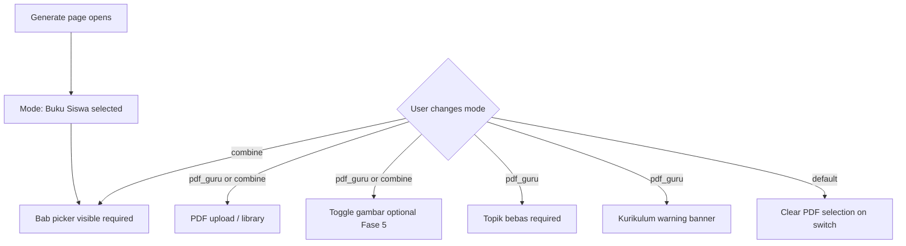

# Product Requirements Document (PRD) v8

## Generate PDF Enhancement — Multi-Source Materi

| Field            | Value                                                                 |
| ---------------- | --------------------------------------------------------------------- |
| **Product Name** | School Exam Generator (Ujian SD)                                      |
| **Version**      | 8.0 — Generate PDF Enhancement                                        |
| **Date**         | 2026-06-29                                                            |
| **Status**       | Draft                                                                 |
| **Baseline**     | PRD v7 (Bab materi picker), RFC 2026-06-10 (PDF handling), PRD v2 US upload intent |
| **RFC**          | [2026-06-29-generate-pdf-enhancement-rfc.md](rfc/2026-06-29-generate-pdf-enhancement-rfc.md) |

---

## 1. Problem

Teachers on `/generate` today can pick Bab from Buku Siswa (PRD v7), but **PDF materi guru is not wired end-to-end**.

| Symptom | Who is affected |
| ------- | --------------- |
| Drag-drop **Materi Ujian** PDF is UI-only — file never reaches the API | All guru who upload worksheet/modul |
| No **perpustakaan PDF** — must re-upload every generate | Guru with recurring custom materi |
| Cannot generate **only from own PDF** (worksheet, LKPD) | Guru outside Buku Siswa scope |
| Cannot **combine** Buku Siswa + local PDF in one sheet | Guru who teach Bab resmi plus materi lokal |
| No **gambar dari PDF** in soal ("Perhatikan gambar…") | IPAS, BI, and diagram-heavy worksheets |
| Full corpus in prompt — **token limit** risk as corpus v2 grows | All mapel at scale |
| Generate is **sync-only** — tab close loses progress; no progressive soal display | Guru on slow connections or long jobs |

**Business impact:** product promises optional PDF materi (PRD v2) but does not deliver. Teachers who rely on custom worksheets cannot use UjianSD for those exams. Competitive products support upload → index → reuse → image-aware questions; we lack that loop while keeping our Kurikulum Merdeka differentiator only for **default** mode.

---

## 2. Solution

Introduce **three explicit source modes**, a **teacher PDF library** stored in **Cloudflare R2**, **topic-focused retrieval (RAG)**, **agentic search**, optional **PDF images**, and **durable streaming generate** — phased so each release is shippable alone.

| Capability | Behavior |
| ---------- | -------- |
| **Source modes** | `default` (Buku Siswa) · `pdf_guru` (PDF only) · `combine` (both) |
| **Default on open** | Mode **Buku Siswa** — no behavior change for existing users |
| **PDF library** | Per-guru list; upload once → ingest → reuse (`status: ready`) |
| **Storage** | PDF + extracted images in **R2 only** (not VPS disk) |
| **Retrieval** | RAG by Bab / free topic — not full-document dump when RAG active |
| **Agentic search** | Multi-step retrieval for broad topics (capped steps — see RFC) |
| **Images** | Toggle `includePdfImages` in `pdf_guru` / `combine`; ~30% soal cap |
| **Streaming** | Progressive soal count + poll stream endpoint (Fase 5) |
| **Durable jobs** | Server-side job continues if browser tab closes (Fase 5) |
| **Kurikulum** | Periksa kurikulum unchanged; warning in `pdf_guru` mode |

### 2.1 Source mode matrix

| Mode | Label UI (draft) | Materi sumber | Bab picker | Topik bebas | PDF | Authority |
| ---- | ---------------- | ------------- | ---------- | ----------- | --- | --------- |
| `default` | Buku Siswa | Korpus SIBI `.md` | Wajib ≥1 (max 8) | Via "Lainnya" (opsional) | Diabaikan | Korpus |
| `pdf_guru` | PDF saya saja | Teacher PDF chunks | Opsional (hint) | **Wajib** (≥10 karakter) | Wajib | PDF only |
| `combine` | Buku Siswa + PDF saya | Korpus + PDF chunks | Wajib ≥1 | Via "Lainnya" (opsional) | Wajib | Korpus > PDF |

### 2.2 UX — conditional fields

- Switching to **`default`**: clear selected PDF and hide image toggle (EC-A6).
- **`pdf_guru`**: show persistent info banner — *"Soal mungkin di luar Capaian Pembelajaran resmi. Gunakan Periksa kurikulum setelah generate."*

---

## 3. User Stories

Each story lists **minimum implementation phase** (F0–F5). See [§7 Phased rollout](#7-phased-rollout).

### US-1 — Generate dari Buku Siswa (default)

**As a** guru SD,
**I want to** generate without uploading a PDF by selecting Bab from the official book,
**So that** questions stay aligned with Kurikulum Merdeka as today.

**Phase:** F0+ (regression — must not break)

**Acceptance criteria**

- [ ] Generate page opens with **Buku Siswa** mode selected
- [ ] Kelas + mapel + Bab required (≥1 Bab, max 8) — same as PRD v7
- [ ] No PDF required; upload area collapsed or hidden in this mode
- [ ] Request uses `sourceMode=default` and omits `pdfUploadId`
- [ ] Review, preview, export behavior unchanged

### US-2 — Generate hanya dari PDF guru

**As a** guru,
**I want to** generate questions only from my worksheet or module PDF,
**So that** I can create exams from custom materi outside the official book.

**Phase:** F1+ (minimal); F2+ (library); F3+ (RAG)

**Acceptance criteria**

- [ ] **PDF saya saja** mode available in selector
- [ ] **Topik bebas** textarea required (minimum 10 characters)
- [ ] Bab picker optional — when filled, used as retrieval hint only
- [ ] PDF required via new upload or library picker (F2+)
- [ ] Kurikulum warning banner visible in this mode
- [ ] Buku Siswa corpus not included in generation context
- [ ] Kelas + mapel still required for sheet metadata

### US-3 — Combine Buku Siswa + PDF guru

**As a** guru,
**I want to** combine official book Bab with my supplemental PDF,
**So that** questions cover official materi plus local context (contoh soal, LKPD).

**Phase:** F1+ (crude); F3+ (RAG merge)

**Acceptance criteria**

- [ ] **Buku Siswa + PDF saya** mode available
- [ ] Bab required (≥1) **and** PDF required
- [ ] On conflict, **corpus authority wins** (RFC prompt policy)
- [ ] Summary sidebar shows selected Bab + PDF filename

### US-4 — Pilih sumber PDF: upload baru vs perpustakaan

**As a** guru,
**I want to** reuse a previously uploaded PDF or upload a new one,
**So that** I do not re-upload every time I generate.

**Phase:** F2+

**Acceptance criteria**

- [ ] Choice: **Upload baru** | **Dari perpustakaan**
- [ ] Library lists only PDFs owned by logged-in guru
- [ ] Only documents with `status=ready` selectable for generate
- [ ] `processing` documents shown disabled with label "Sedang diproses"
- [ ] Generate with library `pdfUploadId` does not re-trigger ingest

### US-5 — Toggle gambar dari PDF

**As a** guru,
**I want to** choose whether questions may include images from my PDF,
**So that** I control complexity and storage cost.

**Phase:** F5 (UI may appear earlier, disabled until F5)

**Acceptance criteria**

- [ ] Checkbox visible only when mode is `pdf_guru` or `combine` **and** PDF selected
- [ ] Default: **off**
- [ ] When on: at most ~30% of questions may reference a PDF image
- [ ] Matematika `figure` SVG (existing) remains independent
- [ ] Review and export render PDF images when question has image reference

### US-6 — Upload PDF ke perpustakaan

**As a** guru,
**I want** my PDF stored securely and indexed,
**So that** I can reuse it across multiple exams.

**Phase:** F1+ (upload); F2+ (library UI + async ingest)

**Acceptance criteria**

- [ ] PDF stored in **Cloudflare R2** (not VPS filesystem)
- [ ] Validation: PDF only, maximum **10 MB** (same as current UI limit)
- [ ] Lifecycle: `uploaded → processing → ready | failed`
- [ ] Guru can delete PDF from library with confirmation
- [ ] Soft-delete: past exams linked to deleted PDF retain metadata (EC-B10)

### US-7 — Streaming: lihat soal muncul bertahap

**As a** guru,
**I want to** see questions appear progressively during generate,
**So that** I know the process is running.

**Phase:** F5

**Acceptance criteria**

- [ ] Progress UI shows counter e.g. "12/20 soal"
- [ ] New questions appear without full page reload
- [ ] Single-question failure does not cancel entire batch (salvage pattern)

### US-8 — Durable: generate lanjut jika tab ditutup

**As a** guru,
**I want** generation to continue on the server if I close the browser,
**So that** I can return later to the result.

**Phase:** F5

**Acceptance criteria**

- [ ] Server-side job with ID and status
- [ ] Closing tab does not stop job
- [ ] Re-open via `examId` — poll stream or view completed result
- [ ] In-app notifications: out of scope v8

### US-9 — RAG topik-fokus

**As a** guru,
**I want** questions drawn from materi relevant to my topic/Bab,
**So that** long reading passages and topic focus are more accurate.

**Phase:** F3+

**Acceptance criteria**

- [ ] Retrieval scoped to selected Bab (`default`/`combine`) or free topic (`pdf_guru`)
- [ ] When RAG active, full book markdown not injected (RFC defines threshold)
- [ ] "Lainnya (ketik sendiri)" from PRD v7 still works in `default` / `combine`

### US-10 — Agentic search untuk materi kompleks

**As a** guru with a broad topic (e.g. "ekosistem dan pencemaran"),
**I want** the system to search sub-topics across documents,
**So that** questions cover varied sub-materi.

**Phase:** F4+

**Acceptance criteria**

- [ ] Agentic step cap per RFC (e.g. max 3 steps)
- [ ] Retrieval trace logged internally for debug (not guru-facing v1)

### US-11 — Periksa kurikulum tetap jalan

**As a** guru,
**I want** Periksa kurikulum on review for all modes,
**So that** I can validate CP even when using custom PDF.

**Phase:** All phases where generate ships

**Acceptance criteria**

- [ ] `POST /api/exams/:id/validate-curriculum` entry point unchanged
- [ ] `pdf_guru`: lower pass rate expected — UI copy explains why
- [ ] `default`: behavior ≥ PRD v7 baseline

### US-12 — Custom materi (Lainnya) di mode default

**As a** guru,
**I want to** type custom materi scope in Buku Siswa mode,
**So that** special classroom needs are still supported.

**Phase:** F0+ (regression)

**Acceptance criteria**

- [ ] "Lainnya (ketik sendiri)" available in `default` and `combine`
- [ ] Not required in `pdf_guru` (free topic field replaces it)

---

## 4. Edge Cases

Format: **ID → Condition → Expected UI → Expected system**

### A. Mode & form validation

| ID | Condition | UI | System |
| -- | --------- | -- | ------ |
| EC-A1 | `pdf_guru` without PDF | Block submit; inline "Pilih atau upload PDF" | 400 if bypassed |
| EC-A2 | `pdf_guru` without free topic | Block submit; inline topik wajib | 400 if bypassed |
| EC-A3 | `combine` without Bab | Block submit | Same as PRD v7 |
| EC-A4 | `combine` without PDF | Block submit | 400 if bypassed |
| EC-A5 | `default` with PDF selected | Clear PDF on mode switch to `default` | Do not send `pdfUploadId` |
| EC-A6 | Mode switch after form fill | Reset PDF/image toggle when → `default`; show/hide fields | No silent PDF submit |
| EC-A7 | Mapel/kelas not ready in catalog | Block generate | Existing catalog gate |
| EC-A8 | Image toggle in `default` | Control hidden | N/A |

### B. Perpustakaan & upload PDF

| ID | Condition | UI | System |
| -- | --------- | -- | ------ |
| EC-B1 | Non-PDF file | Reject with format message | 415 |
| EC-B2 | File > 10 MB | Reject with size message | 413 |
| EC-B3 | Password-protected PDF | Error "PDF terproteksi" | Ingest `failed` |
| EC-B4 | Corrupt PDF | Error + retry offer | Ingest `failed` |
| EC-B5 | Scanned PDF no text layer | Optional quality warning | Ingest may succeed via extraction pipeline |
| EC-B6 | Zero extractable pages | Error | Ingest `failed` |
| EC-B7 | Duplicate filename | Allow; show upload date in list | New `docId` |
| EC-B8 | Select doc `processing` | Disabled row | Cannot generate |
| EC-B9 | Select doc `failed` | Offer re-upload or delete | Cannot generate |
| EC-B10 | Delete PDF used by old exam | Confirm delete | Soft-delete; exam metadata retained |
| EC-B11 | R2 unavailable | Retry message | 503; no orphan DB row without blob |
| EC-B12 | Upload interrupted | Client retry | Idempotent session or orphan cleanup |

### C. Ingest & indexing

| ID | Condition | UI | System |
| -- | --------- | -- | ------ |
| EC-C1 | Ingest crash mid-way | Status failed | Roll back or mark stale partial index |
| EC-C2 | Manual re-ingest same doc | Retry action | Replace chunks idempotently |
| EC-C3 | `includePdfImages=true`, no images in PDF | No error | Text-only generate |
| EC-C4 | Image-heavy PDF | — | Cap stored images per RFC |
| EC-C5 | Chunk/embed failure | Failed status | Ingest `failed` |

### D. Generate & retrieval

| ID | Condition | UI | System |
| -- | --------- | -- | ------ |
| EC-D1 | RAG empty (narrow topic) | "Materi tidak cukup" after one widen retry | 422 or graceful error |
| EC-D2 | Agentic steps exhausted | — | Use best partial material; log warning |
| EC-D3 | Free topic vs Bab hint conflict | — | Free topic primary; Bab low weight |
| EC-D4 | `combine` corpus vs PDF conflict | — | Corpus wins in prompt |
| EC-D5 | Generate timeout | Partial progress shown | Salvage questions in DB |
| EC-D6 | Double submit | Button disabled while in-flight | Idempotency key |
| EC-D7 | Generate while ingest not ready | "PDF masih diproses" | Block |
| EC-D8 | `default` before RAG (F1–F2) | — | Full corpus path — no regression |

### E. Gambar di soal

| ID | Condition | UI | System |
| -- | --------- | -- | ------ |
| EC-E1 | Toggle off | — | No image refs on questions |
| EC-E2 | Toggle on, cap reached | — | Remaining soal text-only |
| EC-E3 | Missing R2 image at render | Placeholder in review | Export placeholder or skip |
| EC-E4 | PDF image + Matematika `figure` | Both render | Allowed |
| EC-E5 | Low-resolution image | — | No upscale |

### F. Streaming & durable jobs

| ID | Condition | UI | System |
| -- | --------- | -- | ------ |
| EC-F1 | Tab closed mid-stream | — | Job continues |
| EC-F2 | Two tabs same exam | Both poll same stream | Single job owner |
| EC-F3 | Poll after complete | Terminal state | No duplicate questions |
| EC-F4 | Server restart mid-job | — | Resume or `failed` + retry per RFC |
| EC-F5 | Navigate away before done | Optional dashboard banner | "Generate masih berjalan" |

### G. Kurikulum & compliance

| ID | Condition | UI | System |
| -- | --------- | -- | ------ |
| EC-G1 | `pdf_guru` low kurikulum pass | Help text, not bug report | Expected |
| EC-G2 | Operator updates corpus (Flow A) | — | `default` uses new corpus; library unchanged |
| EC-G3 | Guru uploads different book edition via `pdf_guru` | Allowed | Not operator re-extract substitute |

### H. Scope boundaries

| ID | Condition | Behavior |
| -- | --------- | -------- |
| EC-H1 | Guru expects upload replaces global SIBI corpus | **Not supported** — operator path |
| EC-H2 | Two PDF guru in one generate | **Out of scope v8** |
| EC-H3 | DOCX/PPT upload | **Out of scope v8** |
| EC-H4 | Share PDF across teachers | **Out of scope v8** |
| EC-H5 | Non-Indonesian OCR | Indonesian default; quality not guaranteed |

---

## 5. Out of Scope (v8)

- Multi-PDF per generate (EC-H2)
- Non-PDF formats — DOCX, PPT (EC-H3)
- Cross-teacher PDF sharing (EC-H4)
- Guru upload replacing global SIBI corpus (EC-H1)
- Web search for materi
- Migrating API runtime to Cloudflare Workers
- Choosing OCR / embedding / generation providers in this PRD (deferred to implementation)
- In-app push notifications for completed jobs

---

## 6. Success Metrics

| Metric | Target | Phase |
| ------ | ------ | ----- |
| PDF library reuse rate | ≥30% of `pdf_guru`/`combine` generates use library (not new upload) | F2+ |
| Time to first soal (streaming) | ≤15 s p95 after job start | F5 |
| Periksa kurikulum pass rate `default` | ≥ PRD v7 baseline | All |
| Periksa kurikulum pass rate `pdf_guru` | Tracked; no hard target (informational) | F1+ |
| Generate completion after tab close | ≥95% jobs complete when tab closed mid-run | F5 |
| Regression: Bab picker accuracy | 100% match corpus (PRD v7) | F0+ |

---

## 7. Phased Rollout

| Phase | Product goal | Modes / stories |
| ----- | ------------ | --------------- |
| **F0** | Corpus v2 richer text (existing operator track) | US-1, US-12 improved grounding |
| **F1** | R2 upload + 3-mode schema + basic generate | US-1–3 minimal, US-6 upload |
| **F2** | Perpustakaan + async ingest + `ready` status | US-4, US-6 library |
| **F3** | RAG topic-focused retrieval | US-9; US-3 merge quality |
| **F4** | Agentic search | US-10 |
| **F5** | PDF images toggle + streaming + durable jobs | US-5, US-7, US-8 |

**Rule:** one implementation milestone per phase — do not ship RAG + agentic + images + streaming in a single release.

---

## 8. References

- [PRD v7 — Bab materi picker](PRD-v7-bab-materi-picker.md)
- [PRD v2 — optional PDF intent](PRD-v2-final.md)
- [RFC 2026-06-10 — PDF handling (Flow A operator path)](rfc/2026-06-10-pdf-handling-rfc.md)
- [RFC 2026-06-29 — Generate PDF enhancement (this feature)](rfc/2026-06-29-generate-pdf-enhancement-rfc.md)
- [Current PDF state](pdf-parse/teacher-exam-current.md)

---

## Appendix A — Pattern reference (QuestGen)

[QuestGen](https://github.com/iyansr/questgen) is **reference only** for product patterns — not our stack specification.

| Pattern (QuestGen) | Adopt in UjianSD | Notes |
| ------------------ | ---------------- | ----- |
| Upload → store → ingest → index | Yes | R2 + Postgres jobs |
| Document library reuse | Yes | Per-guru scope |
| RAG before generate | Yes | Plus our Bab corpus in `default`/`combine` |
| Agentic multi-step retrieval | Yes | Capped steps |
| Extracted PDF images in soal | Yes (F5) | Toggle + 30% cap |
| Streaming / poll progress | Yes (F5) | |
| Kurikulum Merdeka CP/Bab first-class | **Our differentiator** | QuestGen is document-generic |
| Penjaga Kurikulum validation | **Our differentiator** | Keep all modes |
| Default = official Buku Siswa | **Our differentiator** | QuestGen is PDF-first |

We do **not** adopt QuestGen's specific cloud runtime, vector DB product, or AI vendor choices.
