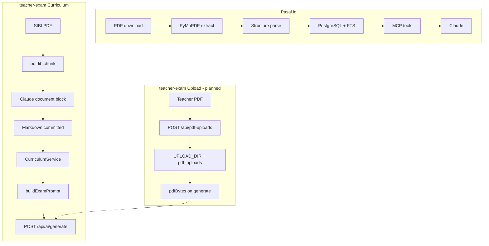

# PDF Parse Documentation

How PDFs are handled in teacher-exam, with reference patterns from [Pasal.id](https://github.com/ilhamfp/pasal) (external, AGPL-3.0).

> **Canonical spec:** [RFC: PDF Handling (2026-06-10)](../rfc/2026-06-10-pdf-handling-rfc.md) — corpus v2, toolchain, new-mapel playbook, teacher upload.  
> The [Foundation RFC](../superpowers/specs/2026-04-22-ujian-sd-foundation-rfc.md) PDF sections are **historical** only.

---

## Key Takeaway

**Pasal.id:** parse once offline → store structured searchable text → MCP tools retrieve from DB (never re-parse PDFs).

**teacher-exam:** extract curriculum once via AI document blocks → commit **text-only** markdown (v2: full `Teks bacaan` per Bab) → runtime reads `.md` only. Teacher upload stores bytes and attaches a document block on generate (not wired yet).

---

## Executive Summary

| Aspect | Pasal.id | Curriculum (ours) | Teacher upload (ours) |
|--------|----------|-------------------|----------------------|
| **Status** | Production | v1 in prod; **v2 target** (full text, no images) | Scaffold only |
| **Parse method** | PyMuPDF + regex structure | Claude document block → markdown | Store bytes, attach on generate |
| **Storage** | PostgreSQL + Supabase Storage | Git-committed `.md` files | `pdf_uploads` table + `UPLOAD_DIR` (unused) |
| **Runtime access** | MCP tools (FTS search) | `CurriculumService` → system prompt | Not wired |
| **MCP** | 4 tools on Railway | None | None |
| **Text extraction lib** | PyMuPDF | None at runtime; PyMuPDF **dev-only** for `curriculum:verify` (planned) | None for MVP |

**v2 change:** Corpus moves from thin index (`Sample teks bacaan`, 2–4 sentences) to full Bab passages (`Teks bacaan`). Images are **not** extracted — wording is enough for SD MCQ.

---

## Tooling quick reference

| Command | Status | Purpose |
|---------|--------|---------|
| `pnpm --filter @teacher-exam/api curriculum:extract` | **Exists** | PDF → markdown (all books) |
| `pnpm --filter @teacher-exam/api curriculum:extract -- --book {slug}` | **Exists** | Single book |
| `pnpm --filter @teacher-exam/api curriculum:verify` | Planned | Verbatim gate ≥95% vs PDF text |
| `pnpm --filter @teacher-exam/api curriculum:stats` | Planned | PDF vs MD word counts |
| `pnpm --filter @teacher-exam/api curriculum:list` | Planned | BOOKS manifest + file status |

Operator workflow: [RFC §6](../rfc/2026-06-10-pdf-handling-rfc.md#6-new-mapel-playbook) · [Curriculum README](../../apps/api/src/curriculum/README.md)

---

## Documents

| Doc | Contents |
|-----|----------|
| [pasal-reference.md](./pasal-reference.md) | Deep dive on Pasal.id: ingest pipeline, PyMuPDF extraction, structural parsing, DB schema, MCP server, verification flywheel |
| [teacher-exam-current.md](./teacher-exam-current.md) | Our two PDF flows with file-level map, gap analysis, provider support, and test coverage |
| [architecture-options.md](./architecture-options.md) | Compare native document block vs local text extraction vs structured pipeline; decision matrix per use case |
| [recommendations.md](./recommendations.md) | Pasal adopt/skip appendix; canonical decisions deferred to RFC §3 and §6 |

---

## Data Flow Comparison

---

## Related Project Docs

- [RFC: PDF Handling](../rfc/2026-06-10-pdf-handling-rfc.md) — **canonical** PDF architecture
- [Curriculum README](../../apps/api/src/curriculum/README.md) — operator quickstart
- [Foundation RFC](../superpowers/specs/2026-04-22-ujian-sd-foundation-rfc.md) — historical (PDF sections superseded)
- [PRD v2 US-7](../PRD-v2-final.md) — teacher PDF upload user story
- [AGENTS.md](../../AGENTS.md) — AI provider PDF notes (MiniMax fallback)

---

## Quick Decisions

See [RFC §3](../rfc/2026-06-10-pdf-handling-rfc.md#3-design-principles). Short answers:

| Question | Answer |
|----------|--------|
| Should we install `pdf-parse` at runtime? | No — document blocks for generation |
| Should we populate `extracted_text`? | Not for MVP; column stays nullable |
| Should we build an MCP server? | Not now |
| How to add a new mapel? | [RFC §6 playbook](../rfc/2026-06-10-pdf-handling-rfc.md#6-new-mapel-playbook) |
| Images in corpus? | No — text-only v2 |
