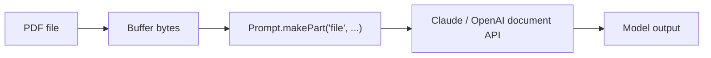
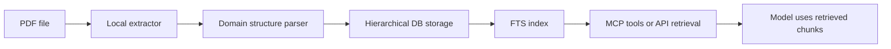

# PDF Architecture Options

Comparison of three approaches for handling PDFs in teacher-exam, with recommendations per use case.

---

## The Three Approaches

### A. Native Document Block (current)

Send raw PDF bytes to the AI provider as a `application/pdf` file part. The model reads the document natively — no local text extraction.

| Pros | Cons |
|------|------|
| Simple — no parser to maintain | Higher token cost per request |
| Model reads layout, tables, images | Provider limits: 100 pages / 32 MB per block |
| Works for one-off extraction scripts | MiniMax needs Anthropic fallback for PDF |
| Already implemented for curriculum | Re-sends full PDF on every generate if used at runtime |

**Used today for:** curriculum extraction (`extract-curriculum.ts`), planned teacher upload.

**Key files:** [`effect-ai/prompt.ts`](../../apps/api/src/lib/effect-ai/prompt.ts), [`pdf-split.ts`](../../apps/api/scripts/lib/pdf-split.ts), [`AiService.ts`](../../apps/api/src/services/AiService.ts).

---

### B. Local Text Extraction

Extract plain text from PDF locally (e.g. `pdf-parse`, `pdf.js`, or a PyMuPDF port) and store the result. Send extracted text in the prompt instead of PDF bytes.

| Pros | Cons |
|------|------|
| Cheaper prompts (text vs document block) | Loses layout, tables, diagrams |
| Searchable stored text | Poor on scanned/image PDFs |
| No provider document limits | Parser maintenance burden |
| Works offline for indexing | Domain-specific cleanup rules needed |

**Originally planned in RFC** (`pdf-parse` npm package, line 28) but **superseded** by Approach A for generation (RFC line 625: `extractedPdfText` dropped from prompt schema).

**Not installed** — `pdf-parse` is not in `package.json`.

---

### C. Pasal-Style Structured Pipeline

Parse PDFs offline into a hierarchical, searchable structure. Serve content via database queries or MCP tools — never re-parse at query time.

| Pros | Cons |
|------|------|
| Parse once, retrieve many times | Heavy engineering investment |
| Fast grounded retrieval with citations | Domain-specific structure rules |
| MCP tool exposure for external AI | Wrong structure for textbooks (BAB/Pasal ≠ Bab/CP) |
| Verification loop possible | Requires FTS setup and chunking strategy |

**Reference:** [pasal-reference.md](./pasal-reference.md) — Pasal.id implements this for Indonesian legal documents.

---

## Comparison Matrix

| Dimension | A. Document block | B. Local extraction | C. Structured pipeline |
|-----------|-------------------|---------------------|------------------------|
| Implementation effort | Low (done) | Medium | High |
| Parser maintenance | None | Ongoing | Ongoing + structure rules |
| Layout preservation | Yes | No | Partial (text-only nodes) |
| Scanned PDF support | Yes (vision-capable models) | Poor without OCR | Poor without OCR |
| Repeat-query cost | High (re-send PDF) | Low (send text) | Lowest (retrieve chunks) |
| Search/index | No | Possible (stored text) | Built-in (FTS) |
| External AI access (MCP) | No | Limited | Natural fit |
| Provider dependency | Anthropic/OpenAI for PDF | None for extraction | None for retrieval |

---

## Decision Matrix by Use Case

### Curriculum baseline (SIBI textbooks)

| Factor | Assessment |
|--------|------------|
| Frequency | One-off extraction, committed markdown |
| Size | Up to 103 MB source PDFs, chunked to 60 pages |
| Output needed | Structured markdown (CP, Bab, sub-konsep) |
| Repeat queries | Corpus loaded from `.md` files — PDF never re-sent at runtime |

**Recommendation: Keep Approach A** for extraction. The output is already structured markdown committed to git. Runtime uses Approach B's *effect* (pre-extracted text in system prompt) without needing a live extractor.

### Teacher optional PDF (generate page upload)

| Factor | Assessment |
|--------|------------|
| Frequency | Per-exam, optional, ≤10 MB |
| Size | Small (10 MB limit in UI) |
| Output needed | Additive context for one generate call |
| Repeat queries | Single use per upload (7-day TTL) |

**Recommendation: Approach A for MVP.** Matches existing `buildPrompt` + `AiService` plumbing. No parser to build. Upload → store bytes on filesystem → load on generate → attach via `pdfBytes`.

`extracted_text` column can remain nullable/unused for MVP.

### Future MCP exposure of curriculum

| Factor | Assessment |
|--------|------------|
| Frequency | External AI tools querying corpus |
| Size | 4+ markdown files, growing with subjects |
| Output needed | Searchable chunks with citations |
| Repeat queries | Many, from different AI clients |

**Recommendation: Consider Approach C subset** — only if product needs external AI access to the curriculum corpus. Would involve:

- Chunk committed markdown by Bab/section
- Store chunks in PostgreSQL with FTS
- Expose search/get tools via MCP (following Pasal's thin-reader pattern)
- No PDF parsing in MCP path

This is a future enhancement, not MVP.

---

## Provider Limits (Approach A)

| Provider | Document block limit | teacher-exam handling |
|----------|---------------------|----------------------|
| Anthropic | 100 pages / 32 MB per block | Curriculum: 60-page soft cap with 5-page overlap |
| OpenAI | Responses API document input | Supported for `AI_PROVIDER=openai` |
| MiniMax | No document input | Proxied to Anthropic via `wrapPdfAnthropicProxy` |

---

## When to Revisit Each Approach

| Trigger | Consider switching to |
|---------|----------------------|
| Teacher uploads same PDF for many exams | B or C — store extracted text/chunks, stop re-sending bytes |
| Need search across uploaded PDFs | B or C — stored text + FTS |
| External tools need curriculum access | C — MCP tools over indexed chunks |
| Scanned textbook PDFs from teachers | A still works (vision models); B/C need OCR layer |
| Token cost becomes significant | B — extract once, send text in prompt |

---

## Related

- [teacher-exam-current.md](./teacher-exam-current.md) — what is implemented today
- [pasal-reference.md](./pasal-reference.md) — Approach C in production (legal domain)
- [recommendations.md](./recommendations.md) — actionable adopt/skip list
