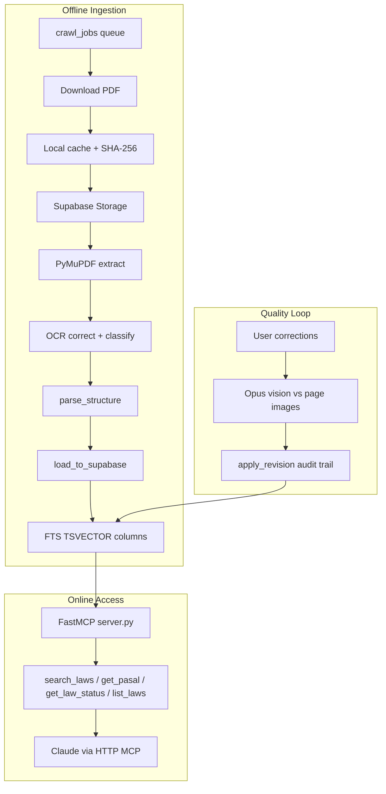
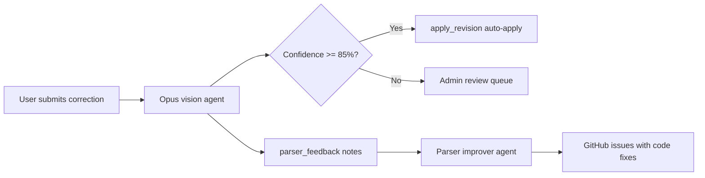

# Pasal.id PDF Pipeline Reference

External reference for [ilhamfp/pasal](https://github.com/ilhamfp/pasal) (AGPL-3.0). Pasal.id is an open Indonesian legal platform that parses government PDFs into structured, searchable data and exposes it to Claude via an MCP server.

**Core pattern:** PDFs are parsed **once** in an offline pipeline. At query time, MCP tools read **pre-indexed PostgreSQL content** — they never re-parse PDFs.

---

## Architecture Overview



---

## A. PDF Ingestion Pipeline

**Entry point:** [`scripts/worker/process.py`](https://github.com/ilhamfp/pasal/blob/main/scripts/worker/process.py)

### Job queue

- Regulations are discovered via crawler and queued in `crawl_jobs`.
- Workers claim jobs atomically with `FOR UPDATE SKIP LOCKED` (prevents duplicate processing across workers).
- Job statuses progress: `pending` → `downloaded` → `loaded` (or `failed`, `no_pdf`, `needs_ocr`).

### Download and deduplication

| Step | Detail |
|------|--------|
| Source | `peraturan.go.id` detail pages (PDF filenames are unpredictable) |
| Local cache | `data/raw/pdfs/{slug}.pdf` (gitignored) |
| Hash | SHA-256 stored in `crawl_jobs.pdf_hash` |
| Skip re-download | If local file hash matches stored hash, reuse cached copy |
| Size limit | 500 MB max per PDF |

### Object storage

- PDFs uploaded to Supabase Storage bucket `regulation-pdfs`.
- Page images rendered via `render_page_images()` for the web PDF viewer and verification agent.
- Public URL stored on the work record (`pdf_storage_url`).

### Re-extraction versioning

`EXTRACTION_VERSION` (currently v6) tracks parser changes. When the parser improves, `reprocess_jobs()` re-runs extraction on loaded jobs with outdated versions — without re-downloading if the local hash still matches.

---

## B. Text Extraction (PyMuPDF)

**Primary file:** [`scripts/parser/extract_pymupdf.py`](https://github.com/ilhamfp/pasal/blob/main/scripts/parser/extract_pymupdf.py)

Pasal uses **PyMuPDF** (`pymupdf`), not the Node `pdf-parse` package. Legacy `parse_law.py` with pdfplumber is kept for reference only.

### Per-page extraction

```python
text = page.get_text("text")
```

Each page is processed individually before concatenation.

### Domain-specific noise removal

Legal PDFs from Indonesian government sources carry repeated headers and watermarks. Pasal strips:

- `PRESIDEN` / `REPUBLIK INDONESIA` header blocks
- Page numbers (`- 3 -`, `Halaman 3 dari 32`)
- `SALINAN` watermarks (common in regional regulations)
- `www.peraturan.go.id`, `djpp.depkumham.go.id` watermarks
- Print timestamps and local `file:///` paths

Stripping happens **per page** (first ~5 lines on pages 2+) rather than only post-concatenation regex — more reliable because position context is known.

### Page-boundary deduplication

When joining pages, Pasal checks up to 200 characters of suffix overlap between consecutive pages. If the next page starts with text already at the end of the previous page, the duplicate prefix is skipped. This fixes repeated headers that survive per-page stripping.

### Safety limits

- 120-second `SIGALRM` timeout per PDF (Unix only) to prevent hangs on malformed files.
- Empty pages and image-only pages tracked in extraction stats.

---

## C. Quality Classification

**File:** [`scripts/parser/classify_pdf.py`](https://github.com/ilhamfp/pasal/blob/main/scripts/parser/classify_pdf.py)

Samples the first 10 pages and classifies:

| Class | Criteria | Routing |
|-------|----------|---------|
| `born_digital` | ≥80% pages have >100 chars, avg >500 chars/page | Direct regex parsing |
| `scanned_clean` | ≥40% pages have text, avg >100 chars | OCR correction pass |
| `image_only` | Mostly images, little extractable text | Marked `needs_ocr`, metadata stored but not parsed |

If extracted text is <100 characters after extraction, `NeedsOcrError` is raised and the job is marked `needs_ocr`.

---

## D. OCR Correction

**File:** [`scripts/parser/ocr_correct.py`](https://github.com/ilhamfp/pasal/blob/main/scripts/parser/ocr_correct.py)

Applied to **all** PDFs (even `born_digital`) because font-encoding artifacts are common. Corrects known OCR substitutions before structural parsing.

---

## E. Structural Parsing

**File:** [`scripts/parser/parse_structure.py`](https://github.com/ilhamfp/pasal/blob/main/scripts/parser/parse_structure.py)

### Text-first philosophy

> Capture ALL text first, then add structural metadata. No text is ever dropped.

Unmatched content becomes `preamble` or `content` nodes — nothing is discarded because a regex failed.

### Hierarchy

```
preamble → BAB → Bagian → Paragraf → Pasal → Ayat
                                    ↘ PENJELASAN (elucidation)
                                    ↘ LAMPIRAN (attachments, parsed as nested law body)
```

### Line rejoining

PDF extraction produces one line per visual row (~50–60 chars). Pasal rejoins wrapped lines when the previous line does **not** end with terminal punctuation (`.`, `;`, `:`). Special cases:

- Ayat markers `(1)`, `(2)` always start a new line.
- List items `a.`, `1.` always start a new line.
- Bare markers (`a.` alone on a line) merge with the next non-blank line.

### Roman numeral Pasal fix

OCR sometimes renders Arabic Pasal numbers as Roman numerals (`Pasal II` instead of `Pasal 2`). Pasal converts these — except in amendment laws and `ATURAN PERALIHAN` sections where Roman numerals are legitimate.

### Output schema

Each node matches the `document_nodes` table:

```python
{
  "type": "pasal",       # bab | bagian | paragraf | pasal | ayat | preamble | ...
  "number": "81",
  "heading": "",
  "content": "...",
  "children": [...],
  "sort_order": 42
}
```

---

## F. Storage Schema

**Migrations:** [`packages/supabase/migrations/`](https://github.com/ilhamfp/pasal/tree/main/packages/supabase/migrations)

### Core tables

| Table | Purpose |
|-------|---------|
| `works` | Regulation metadata (type, number, year, status, slug, FRBR URI) |
| `document_nodes` | Hierarchical content tree; `content_text` + auto-generated `fts` TSVECTOR |
| `revisions` | Append-only audit log for content changes |
| `suggestions` | Crowd-sourced corrections from users |
| `work_relationships` | Amendment/revocation chains between regulations |
| `crawl_jobs` | Scraper job queue with PDF hash, size, extraction version |

### Critical invariant

**Never `UPDATE document_nodes.content_text` directly.** All mutations go through `apply_revision()` (SQL function in migration 020, updated in 038):

1. `INSERT` into `revisions` (old + new content, reason, actor)
2. `UPDATE document_nodes.content_text` (`fts` auto-regenerates via `GENERATED ALWAYS`)
3. `UPDATE suggestions.status` if triggered by a suggestion

All steps run in a single transaction. Rollback on any failure.

### Full-text search

RPC function `search_legal_chunks()` (migration 039, optimized in 043) implements 3-layer search:

1. **Identity fast path** — regex-detects regulation IDs (`uu 10 2011`) → score 1000, early exit
2. **Works FTS** — searches `works.search_fts` for title/topic queries → score ~1–15
3. **Content FTS** — 3-tier fallback on `document_nodes.fts` (`websearch_to_tsquery` → `plainto_tsquery` → `ILIKE`)

Uses Indonesian stemmer (`indonesian` text search config). Candidate CTEs capped at 500 to avoid O(N) snippet generation.

---

## G. MCP Server Design

**File:** [`apps/mcp-server/server.py`](https://github.com/ilhamfp/pasal/blob/main/apps/mcp-server/server.py)

### Transport and deployment

- **Framework:** FastMCP (Python)
- **Transport:** `streamable-http` on Railway
- **Endpoint:** `https://pasal-mcp-server-production.up.railway.app/mcp` (no trailing slash — Starlette 307 redirects break Claude Code HTTP transport)
- **Auth:** `SUPABASE_ANON_KEY` (read-only via RLS; never service role key)

### Registry manifest

[`server.json`](https://github.com/ilhamfp/pasal/blob/main/server.json) at repo root:

```json
{
  "name": "pasal-id",
  "transport": "http",
  "url": "https://pasal-mcp-server-production.up.railway.app/mcp",
  "tools": ["search_laws", "get_pasal", "get_law_status", "list_laws"]
}
```

Connect from Claude Code:

```bash
claude mcp add --transport http pasal-id https://pasal-mcp-server-production.up.railway.app/mcp
```

### Tools

| Tool | Rate limit | Cache TTL | Purpose |
|------|-----------|-----------|---------|
| `search_laws` | 30/min | None | FTS keyword search via `search_legal_chunks()` RPC |
| `get_pasal` | 60/min | 1h | Exact article text with ayat and cross-references |
| `get_law_status` | 60/min | 1h | Validity + amendment/revocation chain |
| `list_laws` | 30/min | None | Browse/filter regulations |
| `ping` | None | None | Health check with DB law count |

### Key design decisions

1. **Tools are thin DB readers** — no PDF parsing, no file I/O at query time.
2. **Workflow guidance in MCP instructions** — server tells Claude: search → get_pasal → get_law_status.
3. **Every response includes a legal disclaimer** — "bukan nasihat hukum".
4. **Rate limiting** — per-instance sliding window (`RateLimiter` class).
5. **TTL cache** — `get_pasal` and `get_law_status` cached 1 hour; law count cached 5 minutes.
6. **Cross-reference extraction** — deterministic regex on legal text, not NLP.
7. **Truncation** — `get_pasal` content capped at 3000 chars with `[...truncated]` notice.
8. **`pasal_number` is a string** — articles can have letter suffixes (`81A`).

### What MCP does NOT do

- Parse or upload PDFs
- Run OCR or vision on documents
- Modify database content (read-only anon key)

---

## H. Verification Flywheel

Pasal embeds AI in the **quality loop**, not in the query path.



| Component | File | Role |
|-----------|------|------|
| Verification agent | [`scripts/agent/opus_verify.py`](https://github.com/ilhamfp/pasal/blob/main/scripts/agent/opus_verify.py) | Opus vision compares parsed text vs original PDF page image |
| Parser improver | [`scripts/agent/parser_improver.py`](https://github.com/ilhamfp/pasal/blob/main/scripts/agent/parser_improver.py) | Aggregates feedback, fetches parser source, creates GitHub issues |
| Revision function | [`scripts/agent/apply_revision.py`](https://github.com/ilhamfp/pasal/blob/main/scripts/agent/apply_revision.py) | Python wrapper for transaction-safe `apply_revision()` SQL |

High-confidence corrections (≥85%) auto-apply. Below threshold, corrections queue for admin review. Every mutation is logged in the append-only `revisions` table.

---

## Summary: Lessons for Other Projects

| Pattern | Why it works |
|---------|-------------|
| Parse once, serve many | Avoids re-parsing PDFs on every AI query |
| Structured storage + FTS | Enables fast, grounded retrieval with citations |
| MCP as retrieval API | Tools read indexed data; PDF parsing stays offline |
| Extraction versioning | Parser improvements can re-process without re-downloading |
| Append-only revisions | Safe content mutations with full audit trail |
| Domain-specific noise rules | Generic PDF extractors miss government header/footer patterns |
| Text-first parsing | No content loss when structure detection fails |
