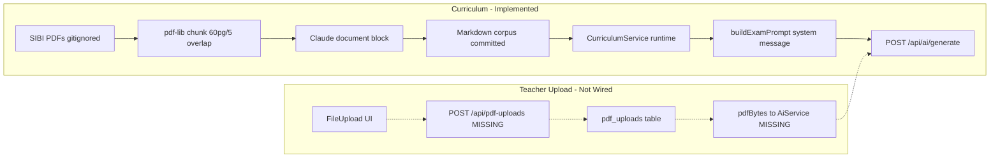
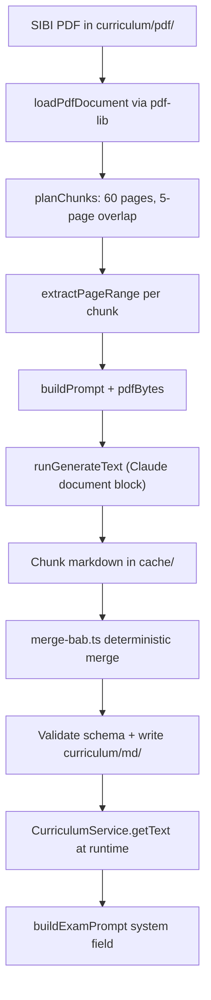

# Teacher-Exam PDF Handling — Current State

This document maps how PDFs are used in teacher-exam today: what works, what is scaffolded, and where the gaps are.

---

## Two PDF Flows

| Flow | Status | Purpose |
|------|--------|---------|
| **Curriculum corpus** | Implemented | One-off extraction of SIBI textbook PDFs → committed markdown grounding every generate call |
| **Teacher reference PDF** | Scaffold only | Optional upload on generate page → intended as additive context for a single exam |



---

## Flow 1: Curriculum Corpus (Implemented)

### Purpose

Ground every `POST /api/ai/generate` call in real Buku Siswa content (Kurikulum Merdeka Fase C) instead of the model's general knowledge.

### File map

| File | Role |
|------|------|
| [`apps/api/src/curriculum/README.md`](../../apps/api/src/curriculum/README.md) | Operator docs for PDF inputs and re-extraction |
| [`apps/api/src/curriculum/pdf/`](../../apps/api/src/curriculum/pdf/) | Source PDFs (gitignored — re-download from SIBI) |
| [`apps/api/src/curriculum/md/`](../../apps/api/src/curriculum/md/) | Committed extracted markdown (runtime corpus) |
| [`apps/api/scripts/extract-curriculum.ts`](../../apps/api/scripts/extract-curriculum.ts) | One-off extraction script (`pnpm curriculum:extract`) |
| [`apps/api/scripts/lib/pdf-split.ts`](../../apps/api/scripts/lib/pdf-split.ts) | Page-range chunking via `pdf-lib` |
| [`apps/api/scripts/lib/merge-bab.ts`](../../apps/api/scripts/lib/merge-bab.ts) | Deterministic merge of overlapping chunk output |
| [`apps/api/src/api/services/curriculum-service.ts`](../../apps/api/src/api/services/curriculum-service.ts) | Loads `.md` files at runtime |
| [`apps/api/src/lib/prompt.ts`](../../apps/api/src/lib/prompt.ts) | `buildExamPrompt()` — corpus in system message |
| [`apps/api/src/lib/prompt-blocks.ts`](../../apps/api/src/lib/prompt-blocks.ts) | Authority order: corpus > teacher PDF |

### Pipeline



### Chunking constants

From [`pdf-split.ts`](../../apps/api/scripts/lib/pdf-split.ts):

| Constant | Value | Rationale |
|----------|-------|-----------|
| `PAGES_PER_CHUNK` | 60 | Soft cap under Anthropic 100-page hard limit |
| `OVERLAP_PAGES` | 5 | Prevent Bab boundaries from being sliced |
| Soft size cap | 25 MB | Headroom over compression variance + prompt tokens |

Anthropic document block hard limits: **100 pages or 32 MB** per block.

### Parsing model

**No local text extraction.** PDF bytes are sent to the model as a native `application/pdf` file part. The model produces structured markdown — not raw text.

```typescript
// apps/api/src/lib/effect-ai/prompt.ts
Prompt.makePart("file", {
  mediaType: "application/pdf",
  fileName: "materi.pdf",
  data: input.pdfBytes
})
```

### Output schema

Every `md/{slug}-kelas-{n}.md` follows a fixed schema (CP, Bab, sub-konsep, sample teks, kosakata). Validated by `extract-curriculum.ts` and [`__test__/curriculum-output.test.ts`](../../apps/api/src/curriculum/__test__/curriculum-output.test.ts).

### Runtime usage

`generateExam()` in [`ai-generate.ts`](../../apps/api/src/lib/ai-generate.ts) loads curriculum text and passes it to `buildExamPrompt()` as the **system message**. No PDF bytes are involved at runtime for curriculum — only the pre-extracted markdown.

---

## Flow 2: Teacher Reference PDF (Scaffold Only)

### Intended behavior

Guru uploads an optional PDF materi/buku (≤10 MB) on the generate page. AI uses it as **additive context** on top of the curriculum corpus — not a replacement.

Authority order (from [`prompt-blocks.ts`](../../apps/api/src/lib/prompt-blocks.ts)):

1. Korpus Buku Siswa = baseline otoritatif
2. PDF guru = konteks tambahan untuk warna lokal

### What exists

| Layer | File | Status |
|-------|------|--------|
| DB schema | [`packages/db/src/schema/pdf-uploads.ts`](../../packages/db/src/schema/pdf-uploads.ts) | Table defined, never written at runtime |
| Shared API type | [`packages/shared/src/schemas/api.ts`](../../packages/shared/src/schemas/api.ts) — `pdfUploadId` optional field | Schema exists, never consumed |
| UI component | [`packages/ui/src/components/file-upload.tsx`](../../packages/ui/src/components/file-upload.tsx) | Client-side picker (PDF only, ≤10 MB) |
| Generate page | [`apps/web/src/routes/_auth.generate.tsx`](../../apps/web/src/routes/_auth.generate.tsx) | Shows `FileUpload`; file stays in local React state |
| AI prompt plumbing | [`apps/api/src/lib/effect-ai/prompt.ts`](../../apps/api/src/lib/effect-ai/prompt.ts) | `pdfBytes` → document block attachment |
| AI service | [`apps/api/src/services/AiService.ts`](../../apps/api/src/services/AiService.ts) | Routes to `pdf` model layer when `pdfBytes` present |
| Prompt text | [`apps/api/src/lib/prompt.ts`](../../apps/api/src/lib/prompt.ts) | User message mentions optional teacher PDF |
| Tests | [`AiService.test.ts`](../../apps/api/src/services/__test__/AiService.test.ts), [`prompt.test.ts`](../../apps/api/src/lib/effect-ai/__test__/prompt.test.ts) | PDF attachment and model routing covered |

### What is missing

| Component | Planned location | Status |
|-----------|-----------------|--------|
| `POST /api/pdf-uploads` | RFC §6 | Not implemented |
| `DELETE /api/pdf-uploads/:id` | RFC §6 | Not implemented |
| Multipart upload handler | — | Not implemented |
| Filesystem storage (`UPLOAD_DIR`) | `.env.example`, Docker | Env/volume prepared, zero runtime references |
| Load PDF bytes on generate | `ai-generate.ts` | `pdfUploadId` never read |
| `extracted_text` population | `pdf_uploads` column | No extraction code |
| TTL cleanup job | `expiresAt` column | No cron/job |
| API client `uploads.pdf()` | `apps/web/src/lib/api.ts` | Not implemented |

### Current generate call (no PDF)

```typescript
// apps/web/src/routes/_auth.generate.tsx — pdfUploadId not sent
void api.ai.generate({
  subject: mapel,
  grade: Number(kelas) as 5 | 6,
  // ... other fields, no pdfUploadId
})
```

```typescript
// apps/api/src/lib/ai-generate.ts — pdfBytes never passed to AiService
const { system, user } = buildExamPrompt({ /* no pdf */ })
```

The prompt text *expects* a PDF ("Jika ada PDF materi guru terlampir…") but none is attached.

---

## AI Provider PDF Support

| Provider | PDF support | Notes |
|----------|-------------|-------|
| **Anthropic** | Native document block | Primary path for curriculum extraction and planned upload |
| **OpenAI** | Responses API document input | PDF materi via OpenAI Responses API |
| **MiniMax** | Does not accept document inputs | `wrapPdfAnthropicProxy` in `AiService.ts` forwards PDF calls to a lazily created Anthropic service |

Model layer routing in `AiService.ts`:

- `pdfBytes` present → `pdf` slot / `pdfModel`
- `pdfBytes` absent → `text` slot / `model`

Keep `ANTHROPIC_API_KEY` set even when `AI_PROVIDER=minimax` if PDF generation should work.

---

## Infrastructure Prepared (Unused)

| Item | Location | Purpose |
|------|----------|---------|
| `UPLOAD_DIR=./uploads` | `.env.example` | Local dev file storage |
| `UPLOAD_DIR: /app/uploads` | `docker-compose.prod.yml` | Production path |
| `uploads_data` volume | `docker-compose.prod.yml` | Persistent upload storage |
| `/app/uploads` directory | `apps/api/Dockerfile` | Created at build time |

No code in `apps/api/src/` references `UPLOAD_DIR` or reads from the uploads path.

---

## Database: `pdf_uploads`

```typescript
// packages/db/src/schema/pdf-uploads.ts
{
  id: uuid,
  userId: text,          // FK → user
  examId: uuid | null,   // FK → exams (optional link)
  fileName: text,
  fileSize: integer,     // bytes
  extractedText: text | null,  // never populated
  uploadedAt: timestamp,
  expiresAt: timestamp   // +7 days per RFC; no cleanup job
}
```

No BLOB column — binary PDF is intended for filesystem/object storage, not Postgres.

---

## Libraries in Use

| Library | Used? | Purpose |
|---------|-------|---------|
| `pdf-lib` | Yes | Page-range splitting for curriculum script only |
| `pdf-parse` | **No** | Mentioned in RFC; not in `package.json` |
| PyMuPDF / local OCR | **No** | Not applicable (TypeScript stack) |

---

## Tests Covering PDF Behavior

| Test file | What it verifies |
|-----------|-----------------|
| [`prompt.test.ts`](../../apps/api/src/lib/effect-ai/__test__/prompt.test.ts) | PDF file part added/omitted in prompt |
| [`AiService.test.ts`](../../apps/api/src/services/__test__/AiService.test.ts) | PDF model layer routing |
| [`AiService.default.test.ts`](../../apps/api/src/services/__test__/AiService.default.test.ts) | MiniMax → Anthropic PDF proxy |
| [`curriculum-output.test.ts`](../../apps/api/src/curriculum/__test__/curriculum-output.test.ts) | Extracted markdown schema validation |

No integration test covers upload → store → generate with PDF end-to-end.

---

## MCP

**No Model Context Protocol implementation** exists in teacher-exam. `.mcp.json` is gitignored (local IDE config only). See [pasal-reference.md](./pasal-reference.md) for how an external project exposes parsed content via MCP.

---

## Related Docs

- [RFC: PDF Handling (canonical)](../rfc/2026-06-10-pdf-handling-rfc.md) — corpus v2, toolchain, teacher upload spec
- [Curriculum README](../../apps/api/src/curriculum/README.md) — operator quickstart
- [Foundation RFC](../superpowers/specs/2026-04-22-ujian-sd-foundation-rfc.md) — historical (PDF sections superseded)
- [PRD US-7](../PRD-v2-final.md) — teacher PDF upload user story
