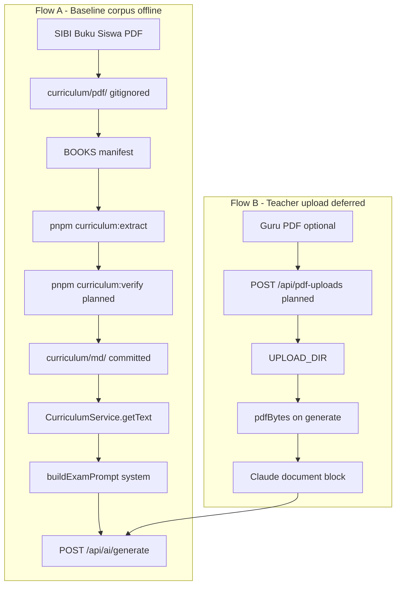
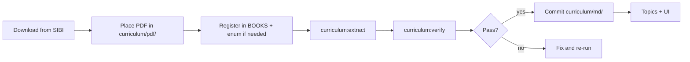

# RFC: PDF Handling — Curriculum Corpus & Teacher Upload

> **Status:** Accepted  
> **Date:** 2026-06-10  
> **Supersedes:** [Foundation RFC](../superpowers/specs/2026-04-22-ujian-sd-foundation-rfc.md) PDF sections (§2 `pdf-parse`, §6 upload wording, prompt pre-extraction)  
> **References:** [Foundation RFC](../superpowers/specs/2026-04-22-ujian-sd-foundation-rfc.md) (historical), [pdf-parse research](../pdf-parse/), [PRD v2 US-7](../PRD-v2-final.md), [Curriculum README](../../apps/api/src/curriculum/README.md), [Pasal.id reference](../pdf-parse/pasal-reference.md)

---

## 1. Problem statement

### 1.1 Corpus v1 is heavily compressed

Offline extraction today produces a **curriculum index**, not a book copy. Measured against local SIBI PDFs (PyMuPDF text extract):

| Book | PDF pages | PDF words (approx.) | MD words (v1) | Compression |
|------|-----------|---------------------|---------------|-------------|
| Bahasa Indonesia K5 | 208 | 27,094 | 1,442 | 18.8× |
| IPAS K5 | 208 | 35,486 | 823 | 43.1× |
| Bahasa Inggris K5 | 208 | 24,176 | 792 | 30.5× |

The v1 prompt asks for `**Sample teks bacaan:**` as a **2–4 sentence** quote. Full cerita, informasi panjang, and LKPD wording are collapsed into bullet **Sub-konsep**.

### 1.2 Quality risk

| Soal type | v1 corpus risk |
|-----------|----------------|
| Faktual / konsep (IPAS, PPKN) | Low — sub-konsep carries facts |
| Kosakata, struktur kalimat (BI) | Low–medium |
| **Soal bacaan panjang** (“Perhatikan teks berikut…”) | **High** — passage truncated |
| Soal yang harus kutip teks buku persis | **High** — short samples only |

Some v1 samples may be **synthesized** (phrases not found verbatim in the source PDF). A verbatim verification gate is required for v2.

### 1.3 Images out of scope

Textbook PDFs embed hundreds of images (diagrams, komik, photos). For SD MCQ generation, **wording from the book is sufficient**. We do **not** extract or store images in the corpus.

Exception (deferred): biology-style **diagram-dependent** soal (“Pada gambar…”) — avoid in prompts until explicitly requested.

---

## 2. Two PDF flows



| Flow | When | Input | Output / runtime |
|------|------|-------|------------------|
| **A — Baseline corpus** | One-off per book; primary path for **new mapel** | PDF in `curriculum/pdf/` | Git-committed `.md` → system prompt |
| **B — Teacher upload** | Per exam, optional | Guru PDF ≤10 MB | Filesystem + `pdf_uploads` row → user message document block |

### Authority order

From [`authorityOrderBlock()`](../../apps/api/src/lib/prompt-blocks.ts):

1. **Korpus Buku Siswa** (system message) = baseline otoritatif untuk CP, bab, sub-konsep, teks bacaan, kosakata.
2. **PDF guru** (user document block, if present) = konteks tambahan — **bukan** pengganti korpus.

---

## 3. Design principles

| Decision | Choice | Rejects |
|----------|--------|---------|
| Curriculum ingest | Offline; parse once, serve many | Re-parsing PDF on every generate |
| Corpus content | **Text only** — full Bab wording (v2) | Image/caption pipeline in corpus |
| Extraction engine | Claude document blocks + chunk merge (Flow A) | `pdf-parse` at runtime |
| Teacher upload | Store bytes; native document block (Flow B) | Required `extracted_text` column |
| Local text extract | Dev-only **verification** (PyMuPDF helper) | Mandatory Pasal-style production parser |
| MCP | Out of scope | PDF tools at query time |
| Biology diagrams | Text-describable concepts only in prompts | Figure corpus until requested |

---

## 4. Corpus schema — v1 (current) vs v2 (target)

### 4.1 v1 (production today)

Enforced by [`merge-bab.ts`](../../apps/api/scripts/lib/merge-bab.ts) `REQUIRED_FIELDS` and [`curriculum-output.test.ts`](../../apps/api/src/curriculum/__test__/curriculum-output.test.ts):

- File size: **5–50 KB**
- Field: `**Sample teks bacaan:**` — short quote (2–4 sentences per extraction prompt)

```md
## Bab {n}: {Judul}
**Topik utama:** ...
**Sub-konsep:**
- ...
**Sample teks bacaan:** "kutipan singkat 2-4 kalimat"
**Kosakata kunci:** ...
**Kompetensi yang diuji:** ...
```

v1 remains valid until each book is re-extracted to v2.

### 4.2 v2 (target)

Replace short sample with **full reading text** per Bab:

```md
## Bab {n}: {Judul}
**Topik utama:** ...
**Sub-konsep:**
- ...
**Teks bacaan:** |
  {full passage(s) from the book — cerita/informasi utuh}
  {multiple paragraphs allowed; verbatim from PDF where possible}
**Kosakata kunci:** ...
**Kompetensi yang diuji:** ...
```

**Include:** all narrative and informasi text for the Bab visible in the PDF chunk.

**Omit:** penerbit boilerplate, daftar isi, glosarium, petunjuk-guru-only pages.

**LKPD:** include exercise **wording** when it contains assessable reading material; skip pure blank worksheets.

**File size cap:** raise test limit from 50 KB → **200 KB** (~8 Bab × substantial text).

**Verbatim rule:** extraction must not invent passages; verification gate enforces this (§5b).

---

## 5. Conversion toolchain

All commands run from repo root via `@teacher-exam/api`.

### 5a. Extract (exists)

| Command | Purpose |
|---------|---------|
| `pnpm --filter @teacher-exam/api curriculum:extract` | Extract all books in `BOOKS` |
| `pnpm --filter @teacher-exam/api curriculum:extract -- --book {slug}` | Single book (e.g. `matematika-kelas-5`) |

**Prerequisites:** `ANTHROPIC_API_KEY` in root `.env` (not a placeholder).

**Pipeline:**

| Step | File | Detail |
|------|------|--------|
| Load PDF | [`pdf-split.ts`](../../apps/api/scripts/lib/pdf-split.ts) | `pdf-lib`; 60 pages/chunk, 5-page overlap |
| AI extract | [`extract-curriculum.ts`](../../apps/api/scripts/extract-curriculum.ts) | Claude document block per chunk |
| Merge | [`merge-bab.ts`](../../apps/api/scripts/lib/merge-bab.ts) | Dedupe Bab; LLM fallback on validation failure |
| Cache | `curriculum/cache/{slug}/` | Resumable on failure |
| Output | `curriculum/md/{slug}.md` | Committed to git |

**Anthropic limits:** hard cap 100 pages / 32 MB per document block; soft cap 60 pages / 25 MB per chunk.

### 5b. Verify, stats, list (specified — implement in follow-up)

| Command | Status | Purpose |
|---------|--------|---------|
| `pnpm --filter @teacher-exam/api curriculum:verify` | Planned | Verbatim gate on all books |
| `pnpm --filter @teacher-exam/api curriculum:verify -- --book {slug}` | Planned | Single book |
| `pnpm --filter @teacher-exam/api curriculum:stats` | Planned | PDF pages / words vs MD words / ratio |
| `pnpm --filter @teacher-exam/api curriculum:list` | Planned | `BOOKS` manifest + pdf/md presence + v1/v2 hint |

**Verify spec:**

- Script: `apps/api/scripts/verify-corpus-text.ts`
- PDF text: `apps/api/scripts/lib/pdf-extract-text.py` (PyMuPDF, dev-only) or `pdf-parse` as **devDependency**
- Parse `**Teks bacaan:**` block (v2) or `**Sample teks bacaan:**` (v1 fallback)
- Pass: ≥**95%** of non-empty lines found as substring in normalized PDF text
- Exit code `1` on failure (CI-friendly)

**Stats output example:**

```
bahasa-indonesia-kelas-5  pdf:208pg/27094w  md:1442w  ratio:18.8x  schema:v1
```

### 5c. BOOKS manifest

Defined in [`extract-curriculum.ts`](../../apps/api/scripts/extract-curriculum.ts):

```typescript
interface BookSpec {
  slug: string           // "bahasa-indonesia-kelas-5"
  subjectKey: ExamSubject
  subject: string        // H1 display label
  grade: 5 | 6
  pdfFilename: string    // must exist in curriculum/pdf/
}
```

Slug must match [`curriculumMdFilename()`](../../apps/api/src/lib/curriculum.ts): `{subject-slug}-kelas-{n}`.

**Future refactor:** extract `BOOKS` to `apps/api/scripts/curriculum-books.ts` shared by extract, verify, stats, list.

---

## 6. New mapel playbook

### 6.1 Operator workflow



### 6.2 Steps

| # | Action | Owner |
|---|--------|-------|
| 1 | Download Buku Siswa PDF from [buku.kemendikdasmen.go.id](https://buku.kemendikdasmen.go.id/) | Operator |
| 2 | Copy to `apps/api/src/curriculum/pdf/{pdfFilename}` | Operator |
| 3 | Add `exam_subject` enum if new mapel | Dev — migration + [`primitives.ts`](../../packages/shared/src/schemas/primitives.ts) |
| 4 | Add `SUBJECT_SLUG` in [`curriculum.ts`](../../apps/api/src/lib/curriculum.ts) | Dev |
| 5 | Add row to `BOOKS` in `extract-curriculum.ts` | Dev |
| 6 | Add topics + UI labels on generate form / prompt config | Dev |
| 7 | `pnpm --filter @teacher-exam/api curriculum:extract -- --book {slug}` | Operator / agent |
| 8 | `pnpm --filter @teacher-exam/api curriculum:verify -- --book {slug}` | Operator / agent (after tool exists) |
| 9 | Guru spot-check one Bab `Teks bacaan` against PDF | Operator |
| 10 | Commit `curriculum/md/{slug}.md` only — **never commit PDF** | Dev |
| 11 | `pnpm test` — `curriculum-output.test.ts` must pass | CI |

### 6.3 Registered books (BOOKS manifest today)

| Slug | Mapel | Kelas | PDF filename |
|------|-------|-------|--------------|
| `bahasa-indonesia-kelas-5` | Bahasa Indonesia | 5 | `Indonesia_BS_KLS_V_Rev.pdf` |
| `bahasa-indonesia-kelas-6` | Bahasa Indonesia | 6 | `Bahasa-Indonesia-BS-KLS-VI_compressed.pdf` |
| `pendidikan-pancasila-kelas-5` | Pendidikan Pancasila | 5 | `Pendidikan-Pancasila-BS-KLS-V.pdf` |
| `pendidikan-pancasila-kelas-6` | Pendidikan Pancasila | 6 | `Pendidikan-Pancasila-BS-KLS-VI-Rev.pdf` |
| `ipas-kelas-5` | IPAS | 5 | `IPAS_BS_KLS_V_Rev.pdf` |
| `ipas-kelas-6` | IPAS | 6 | `IPAS_BS_KLS_VI_Rev.pdf` |
| `bahasa-inggris-kelas-5` | Bahasa Inggris | 5 | `Inggris_FN_BS_KLS_V.pdf` |
| `bahasa-inggris-kelas-6` | Bahasa Inggris | 6 | `Inggris_FN_BS_KLS_VI.pdf` |

### 6.4 Pending — PDFs local, not yet in BOOKS

| PDF in `curriculum/pdf/` | Target slug | Notes |
|--------------------------|-------------|-------|
| `KKA_BS_KLS_5.pdf` | `matematika-kelas-5` | `matematika` enum + `SUBJECT_SLUG` already wired |
| `Matematika_BS_KLS_VI.pdf` | `matematika-kelas-6` | Roadmap M2 — KaTeX before full rollout |

---

## 7. Implementation phases

| Phase | Scope | Deliverable |
|-------|-------|-------------|
| **0 — Docs** | This RFC + README updates | Canonical spec |
| **1 — v2 schema** | Prompt, `REQUIRED_FIELDS`, tests | `Teks bacaan` field, 200 KB cap |
| **2 — Tools** | verify, stats, list scripts | `curriculum:verify`, `:stats`, `:list` |
| **3 — Re-extract** | All books v2 | 8 existing + Matematika 2 |
| **4 — Teacher upload** | Wire upload API + generate | Flow B end-to-end |

Phase **2b** (future): if system prompt exceeds ~15k tokens per book, inject **Bab-level retrieval** at generate time instead of full corpus file.

---

## 8. Teacher upload (Flow B — spec only)

Supersedes foundation RFC “extract text, store in db”.

1. `POST /api/pdf-uploads` — multipart, `application/pdf`, max 10 MB
2. Write `{UPLOAD_DIR}/{id}.pdf`; insert `pdf_uploads` row
3. `extracted_text` stays **null**
4. `expiresAt` = now + 7 days; cleanup job (shape TBD)
5. `generateExam()`: load bytes → `buildPrompt({ pdfBytes })`
6. MiniMax: Anthropic PDF proxy in [`AiService.ts`](../../apps/api/src/services/AiService.ts)

Infrastructure prepared: `UPLOAD_DIR`, Docker `uploads_data` volume — not wired in source.

---

## 9. Out of scope

- Image extraction, komik panels, diagram assets in corpus
- MCP server for PDF or curriculum
- `pdf-parse` (or similar) as **runtime** dependency for generation
- Diagram-dependent biology soal in default prompts
- Committing PDF files to git

---

## 10. Success criteria (Corpus v2)

| Criterion | Target |
|-----------|--------|
| BI K5 Bab 1 `Teks bacaan` | Full *Rana dan Rani* passage (not 5 sentences) |
| Verbatim gate | ≥95% of `Teks bacaan` lines ⊆ PDF text |
| Guru review | 50-soal BI on bacaan-heavy topics ≥90% without heavy edit |
| Tests | `curriculum-output.test.ts` green with v2 field names + 200 KB cap |
| Token budget | Monitor system message size; Phase 2b if needed |

---

## 11. Supersession table

| Document | Old claim | This RFC |
|----------|-----------|----------|
| [Foundation RFC §2](../superpowers/specs/2026-04-22-ujian-sd-foundation-rfc.md) | `pdf-parse` for extraction | Offline corpus via extract tool; document block for upload |
| [Foundation RFC §6](../superpowers/specs/2026-04-22-ujian-sd-foundation-rfc.md) | Upload extracts text to DB | Upload stores bytes only |
| [PRD US-7](../PRD-v2-final.md) | `extracted_text` auto-filled | Column optional; deferred |
| [pdf-parse recommendations](../pdf-parse/recommendations.md) | “Keep v1 as-is” | **v2 target**; v1 interim |
| [pdf-parse README](../pdf-parse/README.md) | Foundation RFC canonical for PDF | **This RFC** canonical |

---

## Related documents

- [Curriculum operator README](../../apps/api/src/curriculum/README.md)
- [pdf-parse research pack](../pdf-parse/)
- [Pasal.id reference](../pdf-parse/pasal-reference.md) (external patterns, AGPL-3.0)
