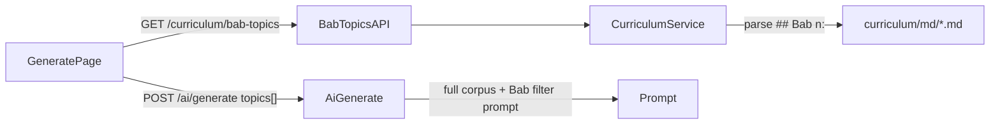

# RFC: Bab-Based Materi Picker (Generate Page)

> **Status:** Accepted | **Date:** 2026-06-25 | **PRD:** [PRD-v7-bab-materi-picker.md](../PRD-v7-bab-materi-picker.md)

---

## 1. Overview

Teachers configure exams on `/generate` by selecting **materi** aligned with **Buku Siswa Bab** structure. Previously:

- Kelas 1–4: single fallback `"Materi sesuai Buku Siswa"`
- Kelas 5–6: hardcoded competency arrays in `apps/web/src/lib/generate-topics.ts`

This RFC defines the replacement: **parse Bab headers from committed markdown** and expose them via API for the Generate UI.

**Label format (mandatory):** `Bab {n}: {judul}` — e.g. `Bab 1: Aku dan Teman-Temanku`, `Bab 3: Harmoni dalam Ekosistem`.

---

## 2. Motivation

| Before | After |
| ------ | ----- |
| One blanket materi for lower grades | Per-Bab selection from book |
| Drift between UI topics and corpus | Single source: `apps/api/src/curriculum/md/*.md` |
| Prompt treated topic as soft directive | Bab labels → strict Bab filter in `buildExamPrompt` |

Aligns with PRD v3 ("topik mengacu bab buku siswa") and foundation RFC Phase 2 (per-Bab filtering at generation time).

---

## 3. Architecture



### 3.1 API

```
GET /api/curriculum/bab-topics?subject={ExamSubject}&grade={Grade}
→ CurriculumBabTopicsResponse
```

Response item:

```json
{
  "bab": 1,
  "title": "Aku dan Teman-Temanku",
  "label": "Bab 1: Aku dan Teman-Temanku"
}
```

- Returns `[]` when subject×grade is not `ready` for generate
- Returns `[]` on curriculum read failure (graceful degrade)

### 3.2 Parser

- **Module:** `apps/api/src/curriculum/parse-bab.ts`
- **Regex:** `^## Bab (\d+):\s*(.+?)\s*$`
- **Shared with:** `apps/api/scripts/lib/merge-bab.ts` (extraction pipeline)

### 3.3 Web

- **Removed:** `apps/web/src/lib/generate-topics.ts`
- **Added:** `apps/web/src/lib/curriculum-bab-topics.ts` — fetch + map labels
- **UI:** Label "Materi", `maxItems={8}`, no auto-select fallback

### 3.4 Prompt

When all `topics[]` match `^Bab \d+:`:

| Selection | Instruction |
| --------- | ----------- |
| 1 Bab | Hanya gunakan konten dari Bab yang dipilih |
| 2+ Bab | Distribusi merata; setiap soal dari salah satu Bab terpilih |

Custom free-text topics keep legacy directive behavior.

### 3.5 Schema

- `CurriculumBabTopicSchema`, `CurriculumBabTopicsUrlParamsSchema` in `packages/shared`
- `GenerateExamInput.topics` max items: **5 → 8**

---

## 4. User Story Traceability

| ID | Story | Implementation |
| -- | ----- | -------------- |
| US-1 | Ulangan Harian 1 Bab | Single Bab select + strict prompt |
| US-2 | UTS multi-Bab | Multi-select + even distribution prompt |
| US-3 | All grades Bab list | API + remove hardcoded lists |
| US-4 | Custom materi | Lainnya + non-Bab prompt path |

---

## 5. Verification

| Check | Evidence |
| ----- | -------- |
| PPKN K1 — 4 Bab labels | API + browser screenshot `.agent-browser/ppkn-k1-bab-list.png` |
| IPAS K5 — 4 Bab labels | API + `.agent-browser/ipas-k5-bab-list.png` |
| No fallback topic in UI | Browser eval + unit tests |
| Tests | `parse-bab.test.ts`, `curriculum.test.ts`, `_auth.generate.test.tsx`, `prompt.test.ts` |

---

## 6. Risks & Mitigations

| Risk | Mitigation |
| ---- | ---------- |
| Book has &lt; 6 Bab (PRD v3 mentioned ≥6 topik) | Show actual Bab count from corpus; book-driven not arbitrary minimum |
| Full corpus still in prompt (token size) | Unchanged from MVP; future: Bab-level retrieval (RFC pdf-handling §Phase 2b) |
| Missing md for ready grade | Catalog should hide non-ready mapel; empty list + warning copy |

---

## 7. Files Changed

| Area | Paths |
| ---- | ----- |
| API parser | `apps/api/src/curriculum/parse-bab.ts`, `bab-topics.ts` |
| API endpoint | `groups/curriculum.ts`, `handlers/curriculum.ts`, `curriculum-service.ts` |
| Shared | `packages/shared/src/schemas/curriculum.ts`, `api.ts` |
| Prompt | `apps/api/src/lib/prompt.ts` |
| Web | `_auth.generate.tsx`, `api.ts`, `curriculum-bab-topics.ts` |
| Removed | `apps/web/src/lib/generate-topics.ts` |
