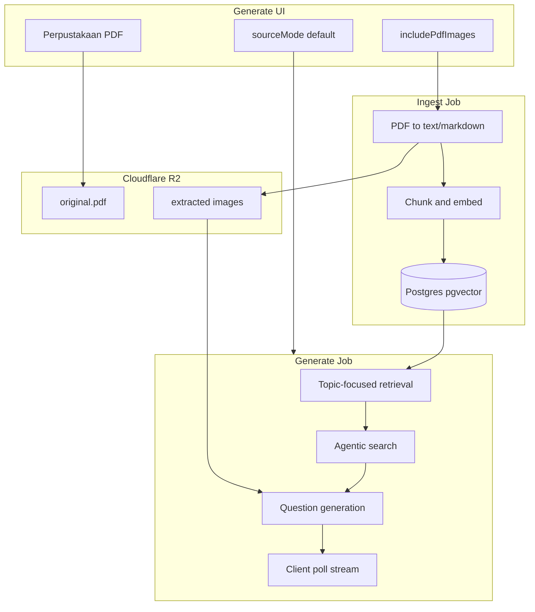

# RFC: Generate PDF Enhancement — Multi-Source Materi

> **Status:** Draft | **Date:** 2026-06-29 | **PRD:** [PRD-v8-generate-pdf-enhancement.md](../PRD-v8-generate-pdf-enhancement.md)

---

## 1. Overview

Teachers on `/generate` gain **three source modes** for materi, a **per-guru PDF library** in **Cloudflare R2**, **topic-focused retrieval (RAG)**, **agentic search**, optional **PDF images**, and **durable streaming generation** — while preserving the **Buku Siswa default** path from PRD v7.

Today:

- Bab picker works (PRD v7)
- PDF upload UI is scaffold-only — file never reaches API ([teacher-exam-current.md](../pdf-parse/teacher-exam-current.md))
- `GenerateExamInput.pdfUploadId` exists in shared schema but is unused

This RFC defines the target architecture. **Provider choices** (OCR, embedding, generation, image captioning) are **deferred** — only logical pipeline interfaces are specified here.

---

## 2. Relationship to prior documents

| Document | Relationship |
| -------- | ------------ |
| [RFC 2026-06-10 PDF handling](2026-06-10-pdf-handling-rfc.md) **Flow A** | **Unchanged** — operator offline SIBI extract → `curriculum/md/` |
| Same RFC **Flow B** + `UPLOAD_DIR` | **Superseded in part** — guru PDF → R2; three modes; library; RAG |
| [RFC 2026-06-25 Bab picker](2026-06-25-bab-materi-picker-rfc.md) | **Unchanged** — Bab API + prompt filter for `default` / `combine` |
| [PRD v7](../PRD-v7-bab-materi-picker.md) | **Extended** — not replaced |
| [PRD v2](../PRD-v2-final.md) optional PDF | **Fulfilled** by this RFC |

**History rule:** prior RFCs are not edited. This document is the canonical spec for v8 generate enhancement.

---

## 3. Three source modes

### 3.1 Behavior matrix

| Field | `default` | `pdf_guru` | `combine` |
| ----- | --------- | ---------- | --------- |
| `sourceMode` value | `default` | `pdf_guru` | `combine` |
| Buku Siswa corpus | Yes | No | Yes |
| Teacher PDF chunks | No | Yes | Yes |
| Bab picker | Required ≥1 | Optional hint | Required ≥1 |
| Free topic (`freeTopic`) | Via "Lainnya" only | **Required** ≥10 chars | Via "Lainnya" only |
| `pdfUploadId` | Ignored | Required | Required |
| `includePdfImages` | N/A (hidden) | Optional | Optional |
| Prompt authority | Corpus | PDF only | Corpus > PDF |
| Kurikulum warning UI | No | Yes | No |

### 3.2 Default on page load

`sourceMode = "default"` — matches current product behavior (D-5, ROADMAP).

### 3.3 Mode switch rules (EC-A5, EC-A6)

- Switch to `default` → clear `pdfUploadId`, `includePdfImages`, hide PDF controls
- Client and server both validate required fields per mode (PRD §4 A)

---

## 4. Architecture



### 4.1 Components

| Component | Responsibility |
| --------- | -------------- |
| **Generate UI** | Mode selector, conditional fields, library picker, progress/stream |
| **Upload API** | Multipart → R2 + DB row + enqueue ingest job |
| **Ingest worker** | Extract → chunk → embed → index; optional image extract |
| **Vector index** | Postgres **pgvector** — corpus chunks + teacher doc chunks |
| **Generate worker** | RAG → agentic → structured questions → batch persist |
| **Stream endpoint** | Poll new questions by `examId` |
| **CurriculumService** | Unchanged for Flow A; corpus chunks indexed separately in F3 |

API continues to run on **VPS Docker** — R2 is object storage only; no Cloudflare Workers requirement.

---

## 5. Cloudflare R2 storage

### 5.1 Key layout

```
documents/{userId}/{docId}/original.pdf
documents/{userId}/{docId}/images/{imageId}.{ext}
```

- `userId` — authenticated guru (better-auth session)
- `docId` — branded UUID (`PdfUploadId`)
- `imageId` — stable ID referenced in chunk metadata and question payload

### 5.2 Environment variables (names only)

| Variable | Purpose |
| -------- | ------- |
| `R2_ACCOUNT_ID` | Cloudflare account |
| `R2_ACCESS_KEY_ID` | S3-compatible access key |
| `R2_SECRET_ACCESS_KEY` | S3-compatible secret |
| `R2_BUCKET_NAME` | Bucket for guru documents |
| `R2_PUBLIC_URL` or signed-URL config | Serve images to review/export |

**No VPS `UPLOAD_DIR`** for guru PDFs (supersedes RFC 2026-06-10 Flow B filesystem).

### 5.3 Soft delete (EC-B10)

- `pdf_uploads.deleted_at` set on guru delete
- R2 objects may be lifecycle-deleted after retention window
- `exams.pdf_upload_id` FK retained; export shows placeholder if blob gone (EC-E3)

---

## 6. API contracts

### 6.1 PDF uploads

```
POST /api/pdf-uploads
Content-Type: multipart/form-data
Body: file (application/pdf, max 10 MB)
→ 201 PdfUploadResponse { id, status: "uploaded" | "processing", filename, createdAt }
```

```
GET /api/pdf-uploads
→ 200 { items: PdfUploadSummary[] }  // scoped to session userId, deleted_at IS NULL
```

```
GET /api/pdf-uploads/:id
→ 200 PdfUploadDetail { id, status, filename, pageCount?, errorMessage?, createdAt, readyAt? }
```

```
DELETE /api/pdf-uploads/:id
→ 204  // soft delete
```

**Status enum:** `uploaded` → `processing` → `ready` | `failed`

| Status | Generate allowed | UI |
| ------ | ---------------- | -- |
| `uploaded` | No | Queued |
| `processing` | No | "Sedang diproses" |
| `ready` | Yes | Selectable |
| `failed` | No | Re-upload / delete |

### 6.2 Extended generate

```
POST /api/ai/generate
Body: GenerateExamInput (extended)
```

New / clarified fields:

```typescript
sourceMode: "default" | "pdf_guru" | "combine"  // default: "default"
pdfUploadId?: PdfUploadId   // required if pdf_guru | combine
freeTopic?: string          // required if pdf_guru (min 10 chars)
includePdfImages?: boolean  // only if pdf_guru | combine; default false
// existing: subject, grade, topics[], difficulty, examType, composition, ...
```

**Validation (HTTP 400):**

| Rule | EC |
| ---- | -- |
| `pdf_guru` without `pdfUploadId` | EC-A1 |
| `pdf_guru` without valid `freeTopic` | EC-A2 |
| `combine` without ≥1 Bab topic | EC-A3 |
| `combine` without `pdfUploadId` | EC-A4 |
| `pdfUploadId` not `ready` or not owned by user | EC-B8, EC-D7 |
| `default` with `pdfUploadId` | Ignore `pdfUploadId` (EC-A5) |

**Response:** `201 ExamWithQuestions` (sync path F1) or `202 { examId, jobId }` (async path F5)

Persist on `exams` row: `source_mode`, `pdf_upload_id` (nullable), `free_topic` (nullable)

### 6.3 Generate stream (F5)

```
GET /api/exams/:examId/generate-stream
→ SSE or JSON poll { status, questionsCount, targetCount, questions[], done, error? }
```

- Poll interval client-side: ~1 s (QuestGen pattern)
- Terminal: `done: true` — no duplicate question inserts (EC-F3)
- Auth: exam must belong to session user

---

## 7. Ingest pipeline (logical)

Provider-agnostic steps executed by **ingest worker**:

1. **Store** — PDF already in R2 from upload handler
2. **Extract** — PDF → markdown/text per page; optional image extraction when `includePdfImages` was requested at upload or re-ingest flag
3. **Caption images** (if extracted) — text description per image for retrieval matching
4. **Chunk** — split markdown (~1500 chars, ~200 overlap — tunable at impl)
5. **Embed** — vector per chunk
6. **Index** — upsert into `document_chunks` with `doc_id`, metadata (`bab_hint`, `page`, `image_refs[]`)
7. **Mark ready** — `status = ready` or `failed` with `error_message`

### 7.1 Idempotency (EC-C1, EC-C2)

- Re-ingest same `docId`: delete prior chunks for `docId`, re-index atomically
- Crash mid-ingest: transaction rollback or mark `failed`; no `ready` with partial index

### 7.2 Corpus indexing (F3)

- Operator corpus (`curriculum/md/`) chunked by `## Bab N:` boundaries
- Separate `source = corpus` vs `source = teacher_pdf` in chunk table
- RAG in `default` queries corpus chunks for selected Bab only

---

## 8. Generate pipeline (logical)

1. **Resolve context** by `sourceMode`
2. **Retrieve** — pgvector similarity; topK 10–20; filter by Bab or `freeTopic`
3. **Agentic search** (F4) — tool `searchDocuments(query, source?, topK)` — max **3** steps; compile `sourceMaterial` markdown
4. **Fallback** (EC-D1) — widen topK once; else 422 `InsufficientMateri`
5. **Generate questions** — structured batch; existing salvage on parse failure
6. **Image attach** (F5) — if `includePdfImages`, set `imageRef` on ≤30% of questions
7. **Persist** — batch insert questions; update job progress for stream

### 8.1 Authority (EC-D4)

Prompt policy for `combine`:

1. Korpus Buku Siswa (CP, Bab, sub-konsep)
2. Teacher PDF chunks (supplemental only)

### 8.2 Agentic exhaustion (EC-D2)

Use best partial `sourceMaterial`; log `retrievalTrace` internally.

### 8.3 Pre-RAG phases (EC-D8)

F1–F2 `default` mode: existing full-corpus `CurriculumService.getText()` path — **no regression** until F3 enables RAG.

---

## 9. Image policy

| Rule | Detail |
| ---- | ------ |
| Toggle | `includePdfImages` default `false` |
| Cap | Max ~30% of questions with PDF `imageRef` |
| Matematika | Existing `figure` JSON SVG orthogonal to PDF images (EC-E4) |
| Missing blob | Placeholder in review/export (EC-E3) |
| No images in PDF | Proceed text-only (EC-C3) |
| Heavy PDF | Cap images stored per doc (EC-C4) — limit TBD at impl |

Question payload extension (F5):

```typescript
imageRef?: string   // → resolved URL at render time
// existing figure?: FigureSpec for Matematika
```

---

## 10. Durable jobs

### 10.1 Tables (conceptual)

**`ingest_jobs`** — `{ id, pdf_upload_id, status, started_at, finished_at, error }`

**`generation_jobs`** — `{ id, exam_id, status, questions_target, questions_done, started_at, finished_at, error }`

### 10.2 Job states

`queued` → `running` → `completed` | `failed`

### 10.3 Recovery (EC-F4)

- Worker restart: reclaim `running` jobs older than timeout → retry once or `failed`
- Partial generate (EC-D5): questions already persisted remain; job `failed` with `examId` for review

### 10.4 Concurrency (EC-F2, EC-D6)

- One active generation job per `examId`
- Duplicate POST: return existing job if in-flight (idempotency-Key header optional)

---

## 11. Edge case → HTTP / job mapping

| PRD EC | HTTP / state |
| ------ | ------------ |
| EC-A1–A4 | 400 validation |
| EC-B1 | 415 |
| EC-B2 | 413 |
| EC-B11 | 503 |
| EC-B3–B6, C1, C5 | ingest `failed` |
| EC-B8, D7 | 409 or 400 "PDF masih diproses" |
| EC-D1 | 422 InsufficientMateri |
| EC-D5 | job `failed`, exam partial |
| EC-F3 | stream `done: true` |

Full matrix: [PRD v8 §4](../PRD-v8-generate-pdf-enhancement.md).

---

## 12. Implementation phases

| Phase | Deliverable | API / data | Modes |
| ----- | ----------- | ---------- | ----- |
| **F0** | Corpus v2 operator extract | git `curriculum/md/` | `default` ↑ |
| **F1** | R2 upload, `sourceMode` schema, sync generate | `POST /pdf-uploads`, extended `POST /ai/generate` | `default`, crude `pdf_guru` |
| **F2** | Library UI, ingest worker, `ready` status | `GET /pdf-uploads`, ingest jobs | + library reuse |
| **F3** | pgvector, corpus + teacher chunks, RAG | chunk tables, retrieval in generate | `default` RAG, `combine` partial |
| **F4** | Agentic search tool | retrieval trace logs | all modes |
| **F5** | Images, stream endpoint, durable generation jobs | `generate-stream`, `generation_jobs` | full |

One milestone per phase — see PRD v8 §7.

---

## 13. User story traceability

| ID | Story | Primary phase |
| -- | ----- | ------------- |
| US-1 | Buku Siswa default | F0+ regression |
| US-2 | PDF guru only | F1+ |
| US-3 | Combine | F1+ / F3+ |
| US-4 | Library picker | F2+ |
| US-5 | Image toggle | F5 |
| US-6 | Upload to library | F1+ / F2+ |
| US-7 | Streaming | F5 |
| US-8 | Durable | F5 |
| US-9 | RAG | F3+ |
| US-10 | Agentic | F4+ |
| US-11 | Periksa kurikulum | all |
| US-12 | Lainnya custom | F0+ regression |

---

## 14. Risks & mitigations

| Risk | Mitigation |
| ---- | ---------- |
| `pdf_guru` kurikulum drift | UI warning; Periksa kurikulum; no CP claim in copy |
| Scope creep (RAG+agentic+images+stream at once) | Enforce phased delivery |
| R2 cost / egress | 10 MB cap; soft-delete lifecycle; image cap |
| Ingest quality on scanned PDFs | EC-B5 warning; guru can use `default` for book materi |
| Token cost agentic | Max 3 steps; cache retrieval per `(docId, topic hash)` |

---

## 15. Deferred decisions (implementation time)

The following are **intentionally not decided** in this RFC:

| Topic | Notes |
| ----- | ----- |
| OCR / PDF extraction provider | Interface: bytes → markdown + optional images |
| Embedding provider | Interface: text → vector dimension D |
| Question generation provider | Existing `AiService` slot pattern |
| Image caption provider | Interface: image bytes → caption string |
| Signed URL TTL vs public bucket | Security review before prod |
| Exact chunk size / topK / similarity threshold | Tune in F3 QA |

---

## 16. Verification (future implementation)

| Check | Evidence |
| ----- | -------- |
| F1 upload → R2 object exists | Integration test + R2 head object |
| F2 library reuse no re-ingest | Two generates same `pdfUploadId`, one ingest job |
| F3 RAG Bab scope | Generate 1 Bab — prompt log shows chunk IDs not full md file |
| F5 stream 20/20 | Browser poll + no console errors |
| Regression PRD v7 | `_auth.generate.test.tsx` Bab picker unchanged in `default` |

---

## 17. Files (expected at implementation — not part of this doc PR)

| Area | Paths (indicative) |
| ---- | ------------------ |
| Shared schema | `packages/shared/src/schemas/api.ts`, pdf-upload types |
| DB | `packages/db/src/schema/pdf-uploads.ts`, migrations chunks/jobs/pgvector |
| API upload | `apps/api/src/api/handlers/pdf-uploads.ts`, R2 client layer |
| API generate | `apps/api/src/lib/ai-generate.ts`, retrieval modules |
| Web | `apps/web/src/routes/_auth.generate.tsx`, library components |
| Jobs | `apps/api/src/jobs/ingest-worker.ts`, `generation-worker.ts` |
