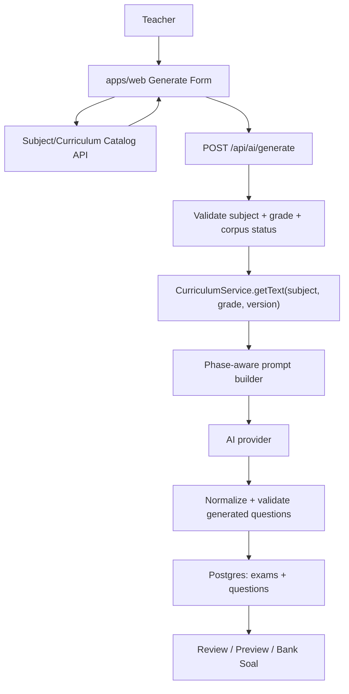
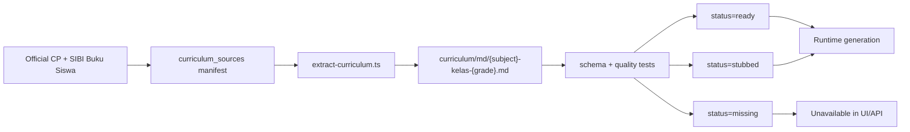
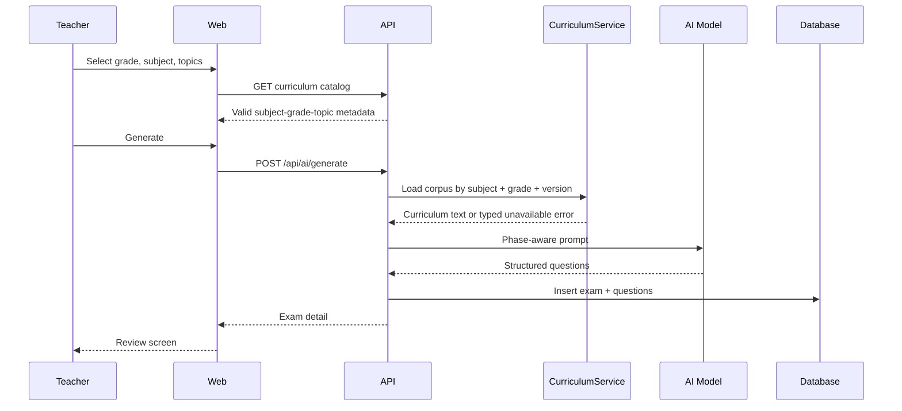
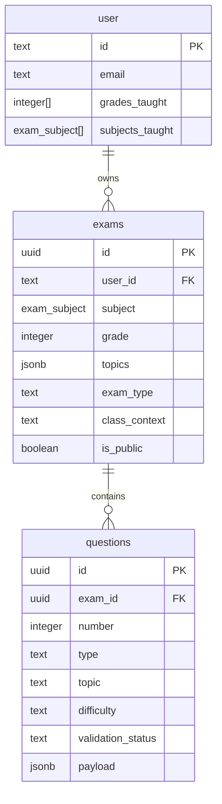
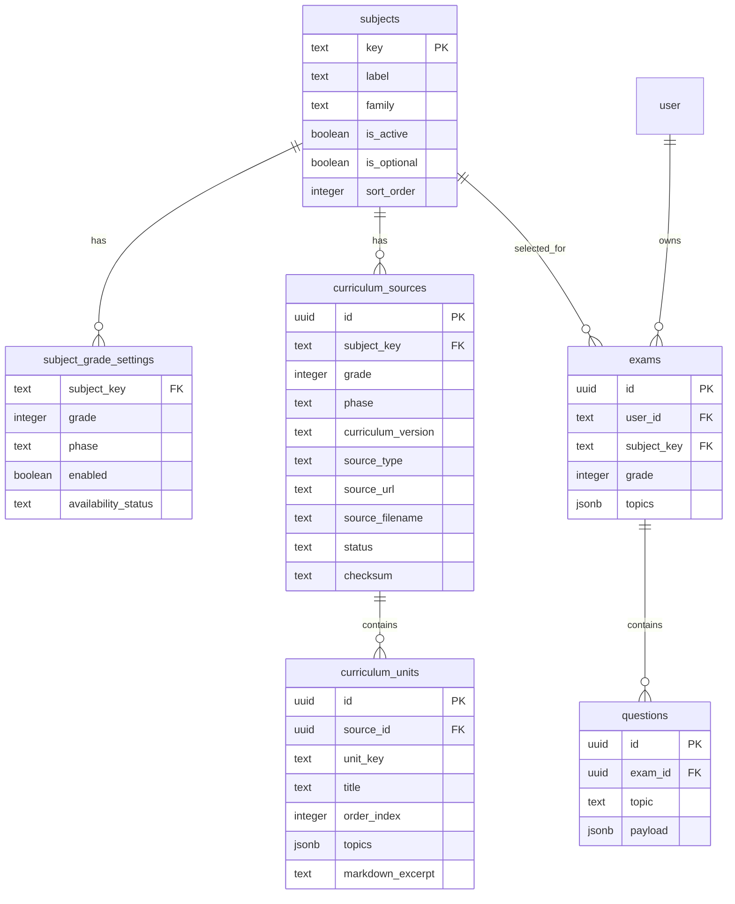

# RFC: Ujian SD - All Mapel Kelas 1-6 Kurikulum Merdeka

> **Status:** Proposed | **Date:** 2026-06-11 | **Author:** Product/Engineering RFC

---

## 1. Overview

**Ujian SD** currently helps teachers generate, review, print, and reuse exam questions for a limited SD scope. The first foundation RFC targeted Kelas 5-6, Fase C, and a small set of mapel. This RFC defines the next product and architecture target: generate Kurikulum Merdeka exam sheets for **Kelas 1-6** and the full elementary-school mapel coverage that the app can responsibly support.

The main change is not only "add more options". Kelas 1-2, Kelas 3-4, and Kelas 5-6 use different phase expectations, reading levels, source books, topic shapes, and assessment constraints. The app must move from hardcoded Fase C assumptions to a data-driven curriculum model.

**Target outcome:** teachers can select a grade first, see only valid mapel and topics for that grade, generate age-appropriate questions grounded in the correct curriculum corpus, review them, print them, and save accepted questions into Bank Soal without breaking existing Kelas 5-6 exams.

---

## 2. Source Grounding

Verified references as of 2026-06-11:

| Source | What it grounds | Link |
|---|---|---|
| Permendikbudristek No. 12 Tahun 2024 | National curriculum regulation for PAUD, pendidikan dasar, and pendidikan menengah. The BPK page marks it as active and changed by Permendikdasmen No. 13 Tahun 2025. | https://peraturan.bpk.go.id/Details/281847/permendikbudriset-no-12-tahun-2024 |
| Kepka BSKAP No. 032/H/KR/2024 | CP is defined per mapel and maps SD phases as Fase A Kelas 1-2, Fase B Kelas 3-4, and Fase C Kelas 5-6. | https://uploads.belajar.id/document/files/Kepka_BSKAP_Nomor_032-2024_Tentang_Capaian_Pembelajaran_pada_Pendidikan_Anak_Usia_Dini%2C_Jenjang_Pendidikan_Dasar_dan_Jenjang_Pendidikan_Menengah_pada_Kurikulum_Merdeka_01j0qf4dzz8dfwzqtpfkkbyzv7.pdf |
| Kepka BSKAP No. 046/H/KR/2025 | Latest CP update surfaced by Ruang GTK. Implementation must verify deltas before extraction and prompt tuning. | https://guru.kemendikdasmen.go.id/dokumen/74r6Yln0zK |
| CP & ATP portal | Public per-mapel, per-fase CP reference for SD-SMA. | https://guru.kemendikdasmen.go.id/kurikulum/referensi-penerapan/capaian-pembelajaran/ |
| SIBI/Buku Kemendikdasmen | Canonical book source for student-book PDF acquisition. | https://buku.kemendikdasmen.go.id/ |

**Engineering rule:** the RFC and implementation should treat official CP and official Buku Siswa as the source of truth. Hand-authored topic lists are allowed only as temporary metadata generated from or reconciled against those sources.

---

## 3. Current Repo State

The app already has the right monorepo split:

| Package | Current role |
|---|---|
| `packages/shared` | Effect Schema request/response contracts and domain primitives |
| `packages/db` | Drizzle PostgreSQL schema and migrations |
| `apps/api` | Effect HttpApi server, AI generation, curriculum services, validators |
| `apps/web` | React 19 + Vite + TanStack Router frontend |
| `packages/ui` | UI primitives and design tokens |

Observed constraints in current code:

| Area | Current state | Expansion concern |
|---|---|---|
| Shared API schema | `GenerateExamInputSchema.grade` is `5-6` | Must accept `1-6` only after backend can validate corpus coverage |
| Subjects | Current enum: Bahasa Indonesia, Pendidikan Pancasila, IPAS, Bahasa Inggris, Matematika | Full SD scope needs a subject catalog, not only a PG enum |
| Curriculum corpus | Markdown exists for Kelas 5-6 only; Matematika is stub-style | Kelas 1-4 needs source ingestion and quality gates |
| Generate UI | Grade select only shows Kelas 5 and 6; copy says Fase C | Needs phase-aware copy and grade-aware mapel/topic lists |
| Topic metadata | Frontend hardcodes topic arrays | Must derive from curriculum metadata to avoid drift |
| Bank/history filters | Depend on current subject/grade assumptions | Must keep old records visible after expansion |

---

## 4. Product Scope

### Supported Grade Phases

| Grade | Phase | Product implication |
|---|---|---|
| Kelas 1 | Fase A | Early literacy, short instructions, simple vocabulary, lower question count defaults |
| Kelas 2 | Fase A | Still early literacy; avoid dense reading passages unless subject requires it |
| Kelas 3 | Fase B | More structured concepts; topics begin to separate more clearly by mapel |
| Kelas 4 | Fase B | Strong candidate for broader IPAS and math generation |
| Kelas 5 | Fase C | Existing core scope |
| Kelas 6 | Fase C | Existing core scope |

### Subject Target

The full target is a **subject catalog** with the SD mapel families below. The first implementation can phase them in by corpus readiness.

| Subject key | Label | K1 | K2 | K3 | K4 | K5 | K6 | Notes |
|---|---|---:|---:|---:|---:|---:|---:|---|
| `pendidikan_agama_islam_budi_pekerti` | Pendidikan Agama Islam dan Budi Pekerti | Yes | Yes | Yes | Yes | Yes | Yes | Religion-specific. Do not flatten all religions into one subject. |
| `pendidikan_agama_kristen_budi_pekerti` | Pendidikan Agama Kristen dan Budi Pekerti | Yes | Yes | Yes | Yes | Yes | Yes | Requires separate corpus and review stance. |
| `pendidikan_agama_katolik_budi_pekerti` | Pendidikan Agama Katolik dan Budi Pekerti | Yes | Yes | Yes | Yes | Yes | Yes | Requires separate corpus and review stance. |
| `pendidikan_agama_hindu_budi_pekerti` | Pendidikan Agama Hindu dan Budi Pekerti | Yes | Yes | Yes | Yes | Yes | Yes | Requires separate corpus and review stance. |
| `pendidikan_agama_buddha_budi_pekerti` | Pendidikan Agama Buddha dan Budi Pekerti | Yes | Yes | Yes | Yes | Yes | Yes | Requires separate corpus and review stance. |
| `pendidikan_agama_khonghucu_budi_pekerti` | Pendidikan Agama Khonghucu dan Budi Pekerti | Yes | Yes | Yes | Yes | Yes | Yes | Requires separate corpus and review stance. |
| `pendidikan_pancasila` | Pendidikan Pancasila | Yes | Yes | Yes | Yes | Yes | Yes | Existing subject. |
| `bahasa_indonesia` | Bahasa Indonesia | Yes | Yes | Yes | Yes | Yes | Yes | Existing subject. |
| `matematika` | Matematika | Yes | Yes | Yes | Yes | Yes | Yes | Existing enum; full corpus and diagram policy still needed. |
| `ipas` | IPAS | Review | Review | Yes | Yes | Yes | Yes | Product must verify official grade coverage and book availability before enabling K1-2. |
| `pjok` | PJOK | Yes | Yes | Yes | Yes | Yes | Yes | Needs practical/health-aware prompt rules. |
| `seni_musik` | Seni Musik | Yes | Yes | Yes | Yes | Yes | Yes | Part of Seni dan Budaya choice family. |
| `seni_rupa` | Seni Rupa | Yes | Yes | Yes | Yes | Yes | Yes | Part of Seni dan Budaya choice family. |
| `seni_teater` | Seni Teater | Yes | Yes | Yes | Yes | Yes | Yes | Part of Seni dan Budaya choice family. |
| `seni_tari` | Seni Tari | Yes | Yes | Yes | Yes | Yes | Yes | Part of Seni dan Budaya choice family. |
| `bahasa_inggris` | Bahasa Inggris | Optional | Optional | Optional | Optional | Optional | Optional | Local/school policy dependent. UI must label as optional/local if not universally enabled. |
| `muatan_lokal` | Muatan Lokal | Optional | Optional | Optional | Optional | Optional | Optional | Needs school-specific corpus, not part of global default. |

**Recommendation:** ship all-mapel as a data-driven target, but expose subjects only when `curriculum_sources.status` is `ready` or explicitly `stubbed`. This avoids pretending unsupported mapel are production-ready.

---

## 5. User Stories

### Teacher Generation Workflow

| ID | User story | Acceptance criteria |
|---|---|---|
| US-1 | As a Guru Kelas 1, I can generate Bahasa Indonesia questions using Fase A language. | Generate form accepts Kelas 1, labels Fase A, produces short age-appropriate questions, and rejects unavailable topics clearly. |
| US-2 | As a Guru Kelas 4, I can generate IPAS questions from Kelas 4 source material. | The backend loads the Kelas 4 IPAS corpus, prompt names Fase B, and questions store grade `4`. |
| US-3 | As a teacher, I choose Kelas before Mapel so I only see subjects valid for that grade. | UI resets subject/topic when grade changes and cannot submit an invalid pair. |
| US-4 | As a teacher, I see a clear unavailable state when curriculum corpus is not ready. | UI displays "Belum tersedia" and API returns a typed 422/400 error, not a generic AI error. |
| US-5 | As a teacher, my older Kelas 5-6 exams and Bank Soal remain visible. | Existing records render with old subject keys and filters still include them. |

### Admin/Developer Workflow

| ID | User story | Acceptance criteria |
|---|---|---|
| US-6 | As a developer, I can track corpus readiness per subject-grade. | There is a table or manifest for ready/stubbed/missing sources. |
| US-7 | As a developer, I can add a new subject without changing frontend hardcoded topic lists. | Frontend consumes subject-grade metadata from API or a shared catalog. |
| US-8 | As a developer, I can re-extract a single subject-grade corpus. | Extraction command accepts `{subject, grade, sourceVersion}` and validates output schema. |

---

## 6. Proposed Architecture

### System Flow



### Curriculum Ingestion Flow



### Review Flow



---

## 7. Database Schema

### Current Core Tables

Current schema stores `subject` as a PostgreSQL enum on `exams`, profile subject arrays as the same enum, and question topic/difficulty as text fields.



### Proposed Catalog Schema

Use lookup tables for long-term expansion. PG enums are okay for a small fixed set, but all-mapel plus religion-specific variants, optional local subjects, and future CP updates will make enum migrations noisy and hard to roll back.



### Migration Strategy

1. Add `subjects`, `subject_grade_settings`, `curriculum_sources`, and `curriculum_units`.
2. Backfill existing enum subjects into `subjects`.
3. Add `exams.subject_key text` nullable, backfill from existing `exams.subject`.
4. Update API reads/writes to use `subject_key` while still reading legacy `subject`.
5. After release confidence, make `subject_key` non-null.
6. Keep legacy enum column until old code paths and migrations no longer need it.

This is safer than replacing the enum immediately because existing production rows, filters, and profile arrays continue to work during rollout.

---

## 8. Backend Changes

### Shared Contracts

Add or revise shared schemas:

```typescript
export const GradeSchema = Schema.Literal(1, 2, 3, 4, 5, 6)

export const PhaseSchema = Schema.Literal("A", "B", "C")

export const CurriculumAvailabilitySchema = Schema.Literal(
  "ready",
  "stubbed",
  "missing",
  "disabled"
)

export const SubjectCatalogItemSchema = Schema.Struct({
  key: Schema.String,
  label: Schema.String,
  family: Schema.String,
  optional: Schema.Boolean,
  grades: Schema.Array(Schema.Struct({
    grade: GradeSchema,
    phase: PhaseSchema,
    availability: CurriculumAvailabilitySchema
  }))
})
```

`GenerateExamInputSchema.grade` should expand from `Schema.between(5, 6)` to `Schema.between(1, 6)` only after subject-grade availability validation exists.

### API Surface

| Method | Route | Purpose |
|---|---|---|
| `GET` | `/api/curriculum/catalog` | Return grade-aware subjects, phases, availability, and topics |
| `GET` | `/api/curriculum/catalog/:subject/:grade` | Return one subject-grade detail |
| `POST` | `/api/ai/generate` | Accept Kelas 1-6, but reject unavailable subject-grade pairs with a typed validation error |
| `POST` | `/api/exams/:id/validate-curriculum` | Use the exam's subject, grade, phase, and curriculum version |

### Curriculum Service

The runtime lookup should become:

```typescript
getText({
  subjectKey,
  grade,
  curriculumVersion = "merdeka-2025"
})
```

Behavior:

| Source status | API behavior |
|---|---|
| `ready` | Generate normally using extracted corpus |
| `stubbed` | Generate allowed only if product enables stub mode; response metadata should mark source as stubbed |
| `missing` | Reject before AI call |
| `disabled` | Hide in UI and reject in API |

### Prompt Behavior

Prompt builder must include:

| Field | Why |
|---|---|
| `phase` | Prevent Fase C assumptions for Kelas 1-4 |
| `grade` | Controls reading level and examples |
| `subjectRules` | Matematika, Bahasa, PJOK, Seni, Agama need different guardrails |
| `corpusStatus` | Avoid silently treating stubs as extracted corpus |
| `questionProfile` | Kelas 1-2 should default to fewer and simpler questions than Kelas 5-6 |

Low-grade rules:

- Use short stems.
- Avoid long multi-paragraph reading passages unless the subject and topic require it.
- Prefer concrete classroom/daily-life contexts.
- Keep distractors simple and unambiguous.
- Avoid higher-order wording that depends on abstract inference unless the CP supports it.

---

## 9. Frontend Changes

### Generate Form

Change the form sequence to:

1. Kelas
2. Mapel
3. Kurikulum/source availability
4. Topic/unit
5. Question settings
6. Teacher focus/context

Rules:

- Grade selection supports Kelas 1-6.
- Subject select is disabled until grade is selected.
- Subject options come from `/api/curriculum/catalog`.
- Subject options show availability:
  - Ready
  - Stubbed
  - Belum tersedia
  - Opsional sekolah
- Topic options come from curriculum units, not hardcoded frontend arrays.
- Copy changes from "Fase C (Kelas 5-6)" to phase-aware text:
  - Kelas 1-2: Fase A
  - Kelas 3-4: Fase B
  - Kelas 5-6: Fase C

### Dashboard, History, Bank Soal

- Filters must support grades 1-6.
- Subject filters must use the catalog, while keeping legacy labels for old enum records.
- Empty states should distinguish:
  - no exams yet
  - no exams for this grade/mapel filter
  - mapel not available yet
- Bank Soal must not hide old Kelas 5-6 questions when new subject keys are introduced.

---

## 10. Curriculum Source Strategy

### Source Manifest

Define a manifest as code or database seed data:

```typescript
interface CurriculumSourceManifestItem {
  subjectKey: string
  label: string
  grade: 1 | 2 | 3 | 4 | 5 | 6
  phase: "A" | "B" | "C"
  curriculumVersion: "merdeka-2025"
  sourceType: "sibi_pdf" | "cp_only" | "school_local"
  sourceUrl?: string
  sourceFilename?: string
  status: "ready" | "stubbed" | "missing" | "disabled"
}
```

### Extraction Requirements

- Each source PDF filename must exactly match the manifest.
- Extracted markdown path remains canonical:
  - `apps/api/src/curriculum/md/{subject-slug}-kelas-{grade}.md`
- Each output must pass a schema test.
- Each extracted source must store source metadata:
  - subject key
  - grade
  - phase
  - source URL
  - source filename
  - extraction date
  - checksum or size
  - status

### Quality Gates

Before enabling a subject-grade in production:

- Markdown exists and is larger than a minimum size threshold.
- Header identifies subject and grade.
- CP section exists.
- Unit/topic sections exist.
- No teacher-guide-only corpus is used as a student-book substitute unless explicitly flagged.
- At least one prompt test covers the phase and subject.
- At least one sample generation is manually reviewed.

---

## 11. Edge Cases And Risks

| Risk | Failure mode | Mitigation |
|---|---|---|
| UI exposes a mapel with missing corpus | Teacher gets generic AI failure | Catalog availability gate blocks submit before AI call |
| Grade 1-2 uses Fase C prompt | Questions are too long or too abstract | Prompt requires phase and low-grade style rules |
| IPAS grade coverage differs by phase/source | App enables unsupported combinations | Mark each subject-grade independently |
| Bahasa Inggris is optional/local | App implies every school teaches it | Label as optional and allow school profile configuration |
| Religion subjects are flattened | Pedagogical and trust issue | Model separate subject keys per religion |
| PG enum expansion keeps growing | Hard migrations and rollback pain | Move to lookup tables and legacy compatibility column |
| Topic metadata drifts from corpus | Teacher selects topic not in book | Generate topics from curriculum units or validate against source |
| Old exams disappear from filters | Regression in history/bank | Keep legacy label resolver and test old fixtures |
| Matematika diagrams render poorly | Broken printable exams | Gate diagram topics behind renderer validation |
| Stub corpus ships as if ready | Lower quality hidden from teacher | Surface `stubbed` in metadata and logs |

---

## 12. GitHub Issue Breakdown

### Epic 1: Subject Catalog And Schema

**Goal:** introduce grade-aware subject metadata without breaking current exams.

Tasks:

- Add shared schemas for `Grade`, `Phase`, `SubjectCatalogItem`, and `CurriculumAvailability`.
- Add DB tables for `subjects`, `subject_grade_settings`, `curriculum_sources`, and `curriculum_units`.
- Backfill current enum subjects into catalog seed data.
- Add compatibility mapping from legacy enum subject to catalog subject key.
- Test: shared schema decode tests and migration tests.

### Epic 2: Curriculum Corpus

**Goal:** make corpus readiness explicit per subject-grade.

Tasks:

- Create manifest for Kelas 1-6 subject-grade coverage.
- Extend `extract-curriculum.ts` to read from the manifest.
- Validate output markdown for each source type.
- Add readiness tests for `ready`, `stubbed`, `missing`, and `disabled`.
- Document source acquisition rules in `apps/api/src/curriculum/README.md`.

### Epic 3: API And Prompt Generation

**Goal:** safely generate exams for Kelas 1-6.

Tasks:

- Add `/api/curriculum/catalog`.
- Update `/api/ai/generate` to validate subject-grade availability before AI calls.
- Expand generation grade schema to `1-6` after validation is in place.
- Add phase-aware prompt blocks.
- Add low-grade prompt tests.
- Add API tests for valid Kelas 1-6 and unavailable combinations.

### Epic 4: Frontend Generate Flow

**Goal:** make selection grade-aware and availability-aware.

Tasks:

- Replace hardcoded Kelas 5-6 select with Kelas 1-6.
- Load subject and topic options from catalog.
- Reset subject/topic when grade changes.
- Replace Fase C copy with phase-aware copy.
- Add unavailable and optional subject states.
- Test generate form behavior for Kelas 1, 4, and 6.
- Browser verify the Generate flow.

### Epic 5: Existing Surfaces And Backward Compatibility

**Goal:** keep current app behavior intact while expanding scope.

Tasks:

- Update dashboard/history/bank filters to use catalog labels.
- Keep old enum subject records readable.
- Add fixtures for old Kelas 5-6 records.
- Verify Bank Soal does not hide older questions.
- Browser verify history and bank filters.

---

## 13. Test Plan

| Layer | Test |
|---|---|
| Shared | Grade schema accepts 1-6 and rejects 0/7 |
| Shared | Subject catalog item validates phase and availability |
| DB | Migration creates catalog tables and backfills current subjects |
| API | Generate accepts valid Kelas 1-6 pairs when corpus is ready |
| API | Generate rejects missing corpus before AI provider call |
| API | Curriculum validation uses exam subject, grade, and version |
| Prompt | Fase A prompt contains low-grade language rules |
| Prompt | Fase B prompt differs from Fase C assumptions |
| Prompt | Matematika prompt keeps diagram topics gated |
| Web | Grade select shows Kelas 1-6 |
| Web | Subject select changes based on grade |
| Web | Topic select derives from catalog response |
| Web | Unavailable subject cannot be submitted |
| Browser | Generate flow has no console errors/warnings |

---

## 14. Rollout Plan

1. **Catalog foundation:** add schema/tables/API while UI still behaves like Kelas 5-6.
2. **Read-only catalog UI:** frontend reads catalog but only enables current ready combinations.
3. **Corpus expansion:** ingest and validate Kelas 1-4 for high-confidence subjects first.
4. **Limited enablement:** enable Bahasa Indonesia, Matematika, Pendidikan Pancasila for Kelas 1-4 after quality gates.
5. **Broader mapel:** add IPAS, PJOK, Seni, Bahasa Inggris, and religion subjects as corpus quality allows.
6. **Clean-up:** migrate fully from enum subject reads to catalog subject keys.

Recommended first release slice:

- Kelas 1-6 UI support.
- Catalog API.
- Ready/stubbed/missing status.
- Current Kelas 5-6 subjects remain enabled.
- Kelas 1-4 combinations hidden or disabled until corpus is verified.

This gives the architecture shape without overpromising content quality.

---

## 15. Non-Goals

- No immediate implementation of all source PDF extraction in this RFC.
- No automatic generation for local school-only muatan lokal without school-owned corpus.
- No replacement of teacher review. AI output still requires teacher approval.
- No guarantee that every official mapel is production-ready on day one.
- No removal of existing Kelas 5-6 enum-backed data during the first rollout.

---

## 16. Open Questions

1. Should Pendidikan Agama subjects be enabled only after a dedicated review pass per religion?
2. Should Bahasa Inggris be globally available or tied to school profile settings?
3. Should Kelas 1-2 default to fewer than 20 questions?
4. Should the app store source provenance on each generated exam for auditability?
5. Should curriculum catalog live in Postgres only, or start as a versioned TypeScript manifest and sync later?
6. How should manual teacher-provided PDFs interact with official corpus priority?

---

## 17. Recommendation

Adopt the catalog-based architecture. The app can keep current Kelas 5-6 behavior stable while adding the model needed for Kelas 1-6. The important engineering move is to separate **what subjects exist**, **which grade-phase combinations are enabled**, and **which corpus source backs generation**.

That separation makes the next implementation safer:

- Product can phase subjects in gradually.
- Backend can reject unsupported combinations before spending AI tokens.
- Frontend can show honest availability states.
- Old exams remain readable.
- Future curriculum changes become data updates instead of enum rewrites.
