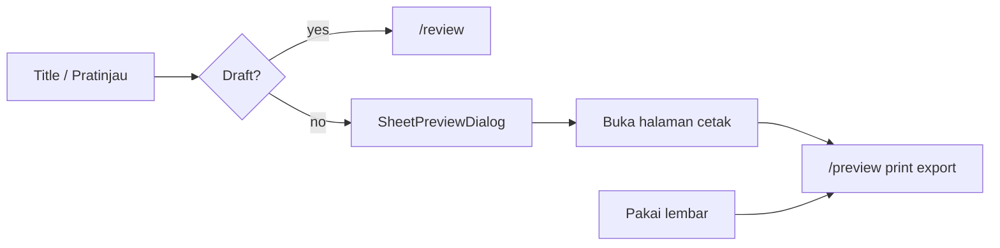

# Design: Unified SheetTable + Modal-First Preview

| Field | Value |
|-------|-------|
| **Status** | Implemented |
| **Date** | 2026-06-29 |
| **RFC** | [2026-06-29-unified-sheet-table-rfc.md](../../rfc/2026-06-29-unified-sheet-table-rfc.md) |

## Goal

One table UI across Dashboard (Riwayat terbaru), Riwayat, Bank Saya, and Bank Publik — same columns styling, variant-specific actions, modal-first preview for Final lembar.

## Variants

| Variant | Page | Key columns | Key actions |
|---------|------|-------------|-------------|
| `dashboard-recent` | Dashboard | Lembar, Mapel, Tanggal, Status | Edit/Duplikat (draft); Pratinjau/Koreksi (final) |
| `history` | /history | + Soal | + Bagikan (final) |
| `bank-mine` | Bank Saya | + Visibilitas | Pakai lembar, Pratinjau, toggle publik |
| `bank-public` | Bank Publik | + Penulis | Pratinjau; Pakai lembar (auth only) |

## Preview flow

## Edge cases (summary)

- Empty states per page unchanged (HistoryEmpty, Bank EmptyState, dashboard copy)
- Modal: 0 accepted soal → "Belum ada soal diterima"
- Public unauthenticated: no Pakai lembar, no print footer in modal
- Koreksi: disabled when `KOREKSI_ENABLED` false (tooltip)
- `questionCount`: from `GET /api/exams` list (accepted count)

## Tests

- `apps/web/src/components/sheet/__test__/*`
- Route: `_auth.history.test.tsx`, `_auth.dashboard.test.tsx`, `_auth.bank-soal.test.tsx`
- Preview page: `routes/__test__/preview/*`
